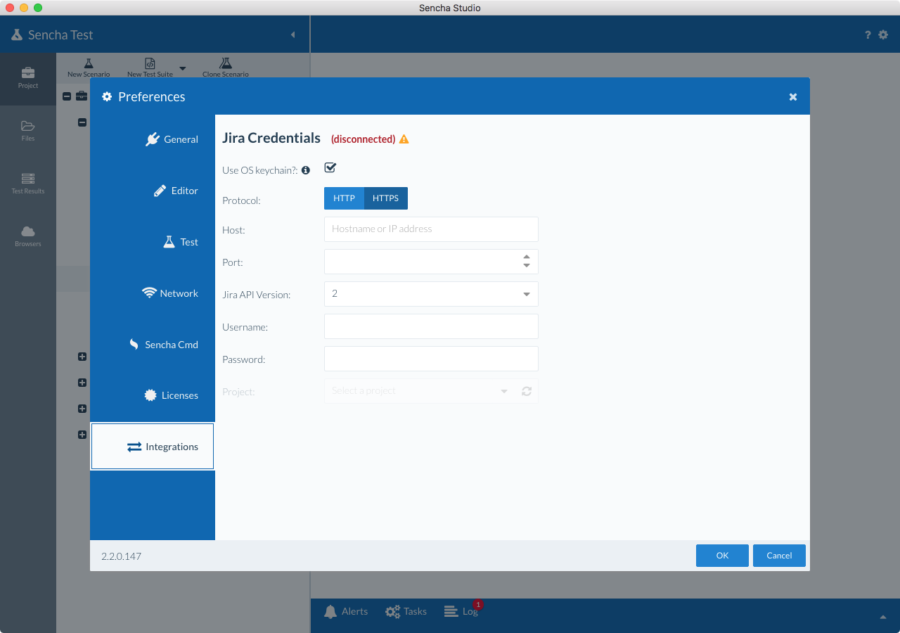
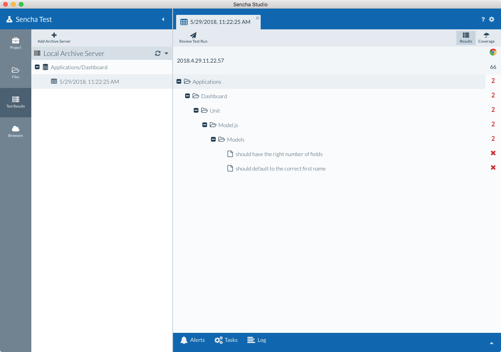

# Introduction to Jira Integration

Sencha Test 2.1 brings expanded end-to-end automation support, from kicking off 
runs using a CI tool, to logging bugs in a defect tracking tool. 

The ALM integration is the first step towards achieving an automated continuous 
testing strategy. In Sencha Test, users leveraging Jira as a defect management tool can 
take advantage of the integration. 

With this integration:

1. Users can review failed tests from the results published in archive server

2. Ignore false negatives

3. Publish verified bugs to Jira along with important information about the 
test, including assertions and screenshots

# Important Notes

Integration with Jira utilizes Jira's REST API. Most instances of Jira have a limit on 
the number of unsuccessful login attempts that are allowed via the API before the user 
must login directly via the browser (this is based on administrative policy - 
[see this document](https://confluence.atlassian.com/adminjiraserver073/configuring-jira-application-options-861253962.html) 
for more information). If the provided credentials are correct but login is unsuccessful, 
the user will have to first log in using a browser, and then attempt 
authentication again within Sencha Test.

# Requirements

A local Archive Server and/or Remote Archive Server is required.

# ALM Integration with Sencha Test Studio

Configuration of Jira integration is performed in the Sencha Test Studio preferences, within the 
Integrations tab. 

Issues from test runs are created in the specified Jira instance from 
the Review Manager, available when displaying the Runs tab of Sencha Test Studio, where 
runs that are managed with an Archive Server are displayed.

## Connect to Jira (One-time setup)

1. Navigate to Preferences in Sencha Studio, and select the Integrations tab

2. Initially, the integration status will show as '(disconnected)'

    

3. Enter your information in the form

4. Once the required information has been entered, Sencha Test will validate your 
credentials and allow you to select a default Jira project to receive issues created by 
Sencha Test.

## Running Tests with an Archive Server

In order to save the test results to the local archive server, select the "Run + Save" option.

## Review Manager

There are many reasons for tests to fail. Not all of them may warrant a bug though. 

The review screen will present all the failed tests along with reasons for failure and 
screenshots (when available). Review the failed tests and publish failures that can be 
classified as defects.

1. After results have been saved to the Archive Server, click on the Test Results tab
in Sencha Studio and view the results by selecting the test run from the tree. 

    

1. The test results are presented along with a "Review Test Run" button at the top
of the screen. Click the Review Test Run button to start reviewing which issues 
you would like to push to Jira.

    

1. Click on a checkbox next to a failed test run and verify the details on the 
right hand side

1. If a selected failed test run is not a bug check the "Ignored" checkbox

1. Ensure all valid bugs are selected and click the "Send Failures" button

### Fetch latest Jira status of a bug

This feature will help users to check for the current status of a bug before reviewing 
all the failed tests in the latest test run.

1. Navigate to the review manager for the latest test run

2. Click on the "Refresh Statuses" button and this will fetch the latest status of all the bugs on 
that test run.