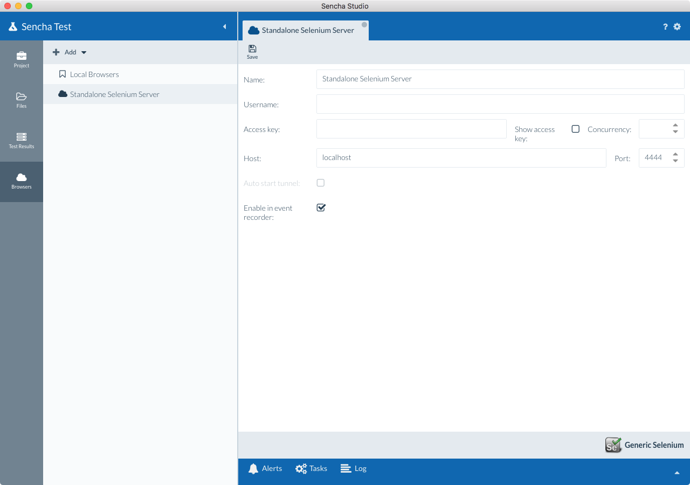
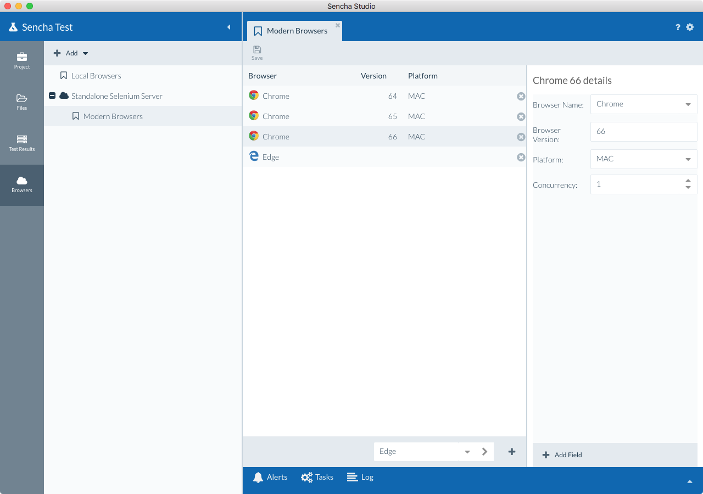

# Standalone Selenium Servers

## Download and Setup

Download the latest version of Selenium Server from http://www.seleniumhq.org/download/.

Based on your browser needs, download the necessary drivers from the same location. You need a driver per browser. 

Firefox needs the new Gecko driver for browser versions greater than 45. Once you have downloaded the drivers 
successfully,add them to the system path so they are globally available, or place them in the same directory
as the Selenium Server `.jar` file. This will ensure that the server is able to communicate with the
browsers.

If you have an existing version of Selenium server, please make sure you upgrade to at least version 3.0 as 
Gecko driver has some known issues with older versions of Selenium Server.

## Starting the Selenium Server

From the command line, Selenium Server can be started using this command:

    java -jar selenium-server-standalone-3.11.0.jar

By default, this will start the Selenium Server instance on port 4444. The port can be changed by setting the 
`-port` flag:

    java -jar selenium-server-standalone-3.11.0.jar -port 5555

## Defining a Selenium Server Configuration in Sencha Studio

Sencha Test allows easy configuration of a Selenium farm. 

1. Navigate to the "Browsers" tab in Sencha Studio. 

    

1. Select Add --> Generic WebDriver and give your WebDriver farm a suitable display name.

    
    
1. After adding, the Selenium Server configuration will show up in the list of Browser Farms. Select it,
and provide the IP address of the machine (`localhost`, if same machine) where the Selenium server will be 
running and enter `4444` for the port value.

    **Note:** If you want to use browsers in this farm with the event recorder, check the "Enable in 
    event recorder" option, and browsers in the farm will show up for selection when launching the 
    event recorder within a test suite. For a list of supported browsers with the event recorder, see the 
    [Event Recorder Browser Support guide](../event_recorder/event_recorder_browser_support.html).

    
    
1. Press Save.
    
1. Right-click on the Selenium farm and select "Add pool...".

    

1. Give a name for the browser pool and select a location to save the 
pool configuration file. We recommend that you save the pool configuration file within the workspace.

1. Click on the pool that you just created.

1. Select and add browsers using the drop-down list at the bottom of the browser pool screen.

    

1. Once added, you can select each browser from the grid and define a platform, browser version, etc. 
After you have made your changes, click Save. 

    **Note:** Make sure you have downloaded the browser drivers as stated above.

    
