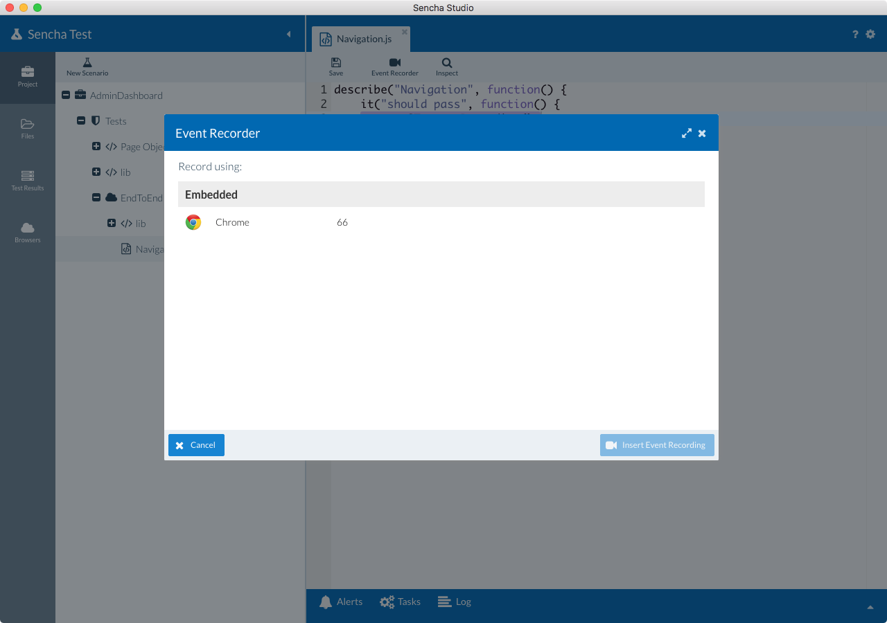
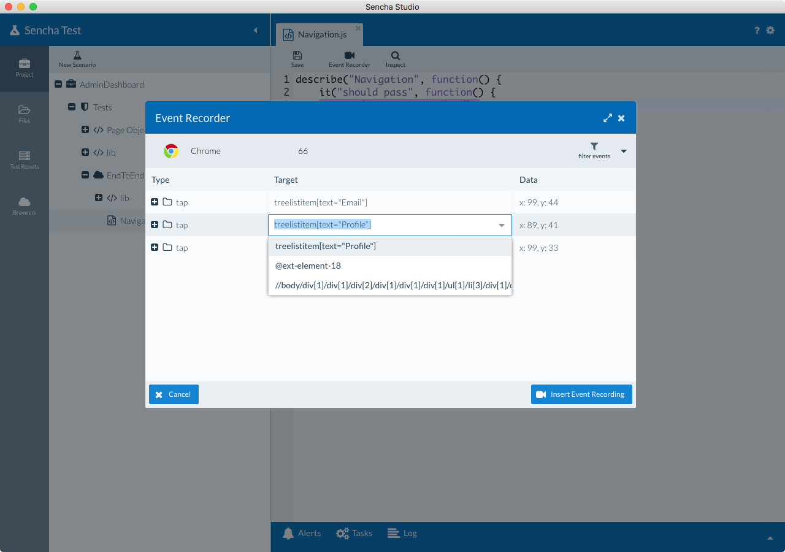
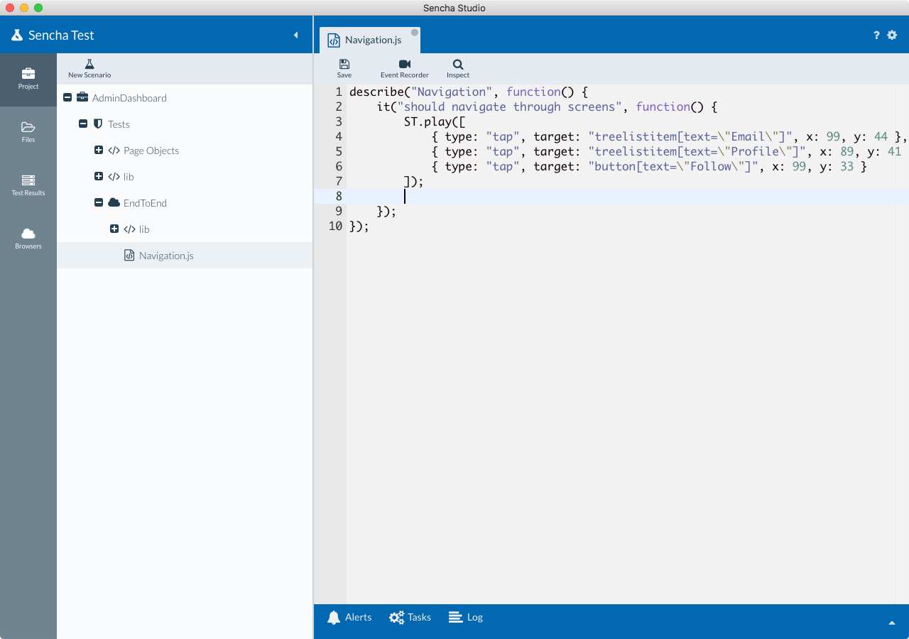

# Introduction to Event Recorder

The event recorder is a key element of Sencha Test. It tracks user actions and creates meaningful code that 
indicates the following:
 
+ What kind of action a user performed - “tap”, “type” etc.
+ Where did the user perform the action - “button”, “form field” etc.
+ How is the target identified - id, component query, composite query, XPath

For a list supported browsers on each platform, please see 
[Event Recorder Browser Support](./event_recorder_browser_support.html).

## Recordings
When a user performs an action like tapping a button or typing into a form field, the user's action is captured.  **Where** 
the user has performed the actual operation is identified using the locator. 

The Sencha Test event recorder offers three distinct strategies for getting component references; ID, Component Query, and XPath.

### ID
The ID of the element under test is captured. This **could** be a value dynamically generated by the Ext JS 
framework.  This means that it may not be stable for long term test automation.

### Component Query
Ext JS / ExtReact component query lets you identify exactly where a component resides in the hierarchy. The query can be helpful 
to identify the exact element using one of its properties such as title, class, etc. 

## Using the Event Recorder
Follow these steps to use the event recorder.

1. Open a Jasmine test suite file

2. Create a new test case. Jasmine test cases should be written inside of an `it` function, which resides within 
a `describe` function.
		    
        describe('login form', function () {
            it('should deny access with wrong creds', function () {
                // Your test code goes here
            });
        });
    	
3. Before recording, ensure you have set the target application’s URL in the project settings screen. Without 
setting a valid URL, you won't be able to launch your application under test via the event recorder.

4. Place the cursor inside of the `it` block and launch the event recorder by clicking the Event Recorder 
button.

	

5. A window will be shown with browser options. If you're using the Sencha Test 2 WebDriver scenario option, you will 
be able to record using the embedded Google Chrome browser option out of the box. For this, you will need to have Google Chrome installed on the target machine. 

    If you are running an In-Browser scenario option, 
    you will be able to use any of the local browsers on your machine for recording.

	

6. Once the browser is selected, the application is rendered in the browser. Wait for the recorder to be 
ready before you perform actions on the application. Look for the following screen before you start working 
on the application.

	

7. Perform various operations on the application based on the purpose of your test case.

8. The events are captured as the operations are performed. In Sencha Studio, a grid is displayed in the 
Event Recorder window. Check the value in the Target column. This could be an auto-generated `id` by the Ext 
JS or ExtReact frameworks. 

    Click on one of the locators in the Target column, and you will be able to edit or select one of the other 
    locators generated by the Event Recorder. Based on where the actions are performed, a component query may 
    be generated. Select this option for more stable test execution.

		

9. In the above screen, there is a grid with a Target column. This represents the target locators for identifying elements 
within the application. In an Ext JS and ExtReact application you will see multiple locator strategies such as ID, component 
query, etc. For any other web application, the ID or XPath will be captured by the Sencha Test event recorder.

10. Once you have finished recording all of the steps from the test case, click on the "insert recording" button.

11. The recorded scripts are stored under a ST API called `ST.play`. It looks something similar to this: 
			
        ST.play([
            { type: "tap", target: "treelistitem[text=\"Email\"]", x: 99, y: 44 },
            { type: "tap", target: "treelistitem[text=\"Profile\"]", x: 89, y: 41 },
            { type: "tap", target: "button[text=\"Follow\"]", x: 99, y: 33 }
        ]);
	
	

12. Finally, add any `expect` statements after the `ST.play` block.
