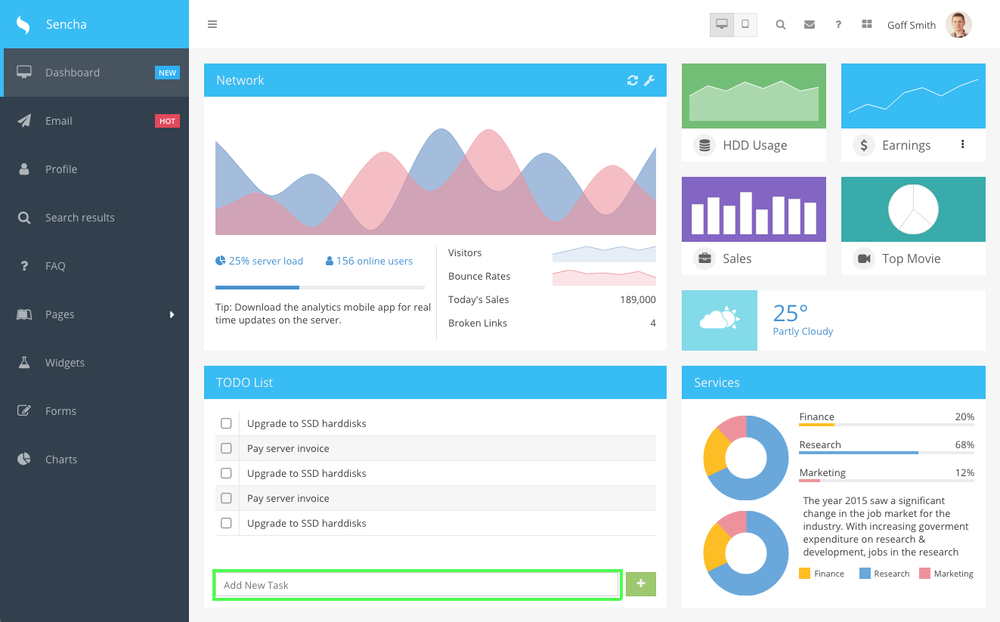
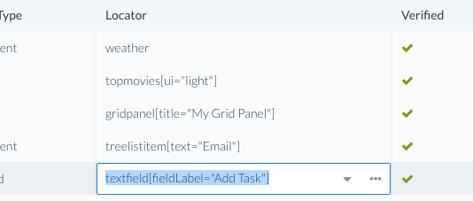
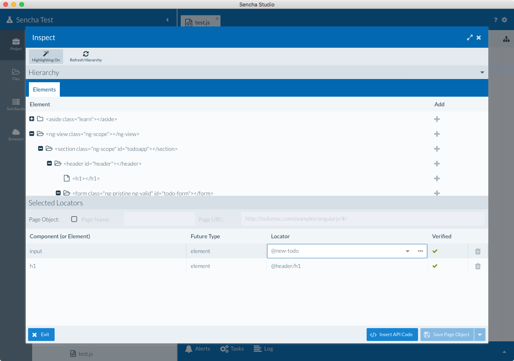
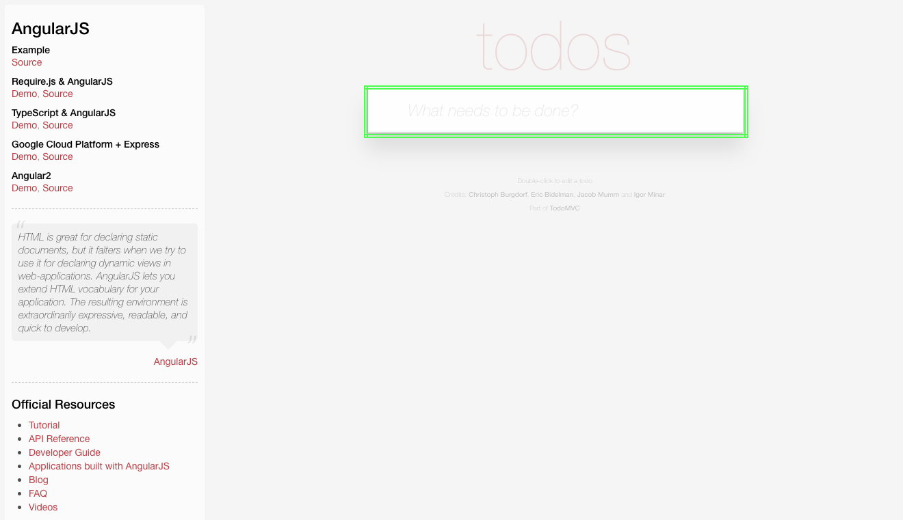

# Introduction to the Inspect Tool

The Inspect tool enables users of Sencha Test to easily locate components and elements in a running 
web application and create both locator strings as well as Page Objects for 
accessing those components in tests.

## Functionality/Overview

* View hierarchy of all components on an Ext JS application page, and a hierarchy of elements on non Ext JS web applications.

* Add components from that hierarchy to a list of selected locators.

* Hover over the web page in a browser and click to select components/elements. 
These components/elements are then added to the list of selected locators.

* When clicking on hierarchy components/elements or selected locators, Inspect will attempt to 
highlight the component in the browser with a green rectangle.

* Selected locators may be given a page name and individual names and saved as Page 
Objects to be used in tests as `stpo.<page name>.<locator name>`.

* A wizard is available to add hierarchical parents to the locator as well as advanced 
properties as well.

* Selected locators can simply be inserted into the current test as ST Futures API 
expressions. Using the Page Objects feature is not required to make use of Inspect 
to generate locators.

* JavaScript expressions to access Page Objects can be inserted into the current test 
if Page Objects and named locators are present.

## Inspect Tool for Locators

The Inspect tool helps you derive meaningful locators from elements on the web page. If you 
consider a simple scenario where you have to enter a value in a text field, you’ll see 
the significance of a good locator. For an Ext JS text field on a page, the framework may assign a 
default auto-generated `id` of `@textfield-1143`. As Ext JS is a highly componentized framework, we 
can use a Component Query instead of the `id`. The Component Query for the text field shown
below is `textfield[fieldLabel="Add Task"]`.

## Using the Inspect Tool

Follow these steps to use the Inspect tool either with an In-Browser (single page application) 
or WebDriver Scenario (multi page application) test.

**Note:** A WebDriver scenario needs to be used even if there is just a login page that 
redirects to a single page Ext JS app. 

If you are starting from scratch, have no tests, and already have a deployed application URL, these steps describe how to use the Inspect tool:

1. Create a new Jasmine Test Suite within your Scenario

1. Open the newly created Jasmine spec file

1. Use the pre-made test case `should pass`.

1. Place the cursor inside of the `it` block and launch the Inspect tool by clicking the 
Inspect button (search icon).

1. Select a browser

1. Wait for the browser to open, application to be loaded and started and for the 
Inspect grid of the component hierarchy to be presented and filled out.

1. If the application/URL you configured in the Scenario points to a login page, and you need to inspect the main part of the application, you will need to execute some steps before using Inspect. You can 
achieve this in two ways:

    + Add code to your test which navigates to the main part of the app. A common situation is a login page.
    
            describe("test", function() {
                it("login then inspect", function() {
                    ST.element('@email').type('a-username');
                    ST.element('@password').type('a-password');
                    ST.element('@submit').click();

                    // Insert your cursor here, and use the Inspect tool.
                    // The steps above will be executed before Inspect is used.
                });
            });

    + Press `Ctrl/Cmd-I` to disable inspecting in the browser and proceed to navigate to 
    the main part of your application.

1. At this point you should see a component hierarchy in the Inspect window. You can 
navigate around in this hierarchy. 

    

1. When you click on a component in the hierarchy you may see the component highlighted in 
the browser with a bright green rectangle. A message will inform you if a component was highlighted or not. If a component is hidden you will not see it highlighted.

    

Using the selected value, you can take two different paths here:

1. Create ST API code using the locators
1. Create Page Object code

### Inserting ST API Code

ST APIs allow you to create tests targeting Ext JS components and generic elements in 
web applications. The Inspect tool generates ST API code directly in the editor that can be 
extended with appropriate API methods based on the test case.

## Using the Inspect Wizard

The Inspect Wizard allows users to select more properties to get a one-to-one match with 
a component or element. The Inspect Wizard can be accessed by clicking in one of the Locator cells in the
Selected Locators grid, and clicking the ellipsis icon:

When a locator matches multiple components/elements, additional properties may be 
needed to narrow down to a specific component/element and this can be done by launching the 
wizard. Every time a new property is added, the wizard will indicate the number of 
matching components/elements. The user can save the locator and use it within a test when 
there is just one match.

## How to change URL to inspect a specific page

The below approach will let you use the Inspect tool to create meaningful locators. We will 
be enhancing this feature in the future so the page navigation and the URL updates 
will be captured more effectively.

### Single Page Applications

1. A page in a single page application can be accessed by just changing the anchor. 
For example, in the sample application on Sencha’s website 
[http://examples.sencha.com/extjs/6.2.0/examples/admin-dashboard/#dashboard](http://examples.sencha.com/extjs/6.2.0/examples/admin-dashboard/#dashboard) - 
`#dashboard` is the anchor. 

2. To inspect the email view, a new spec should be created. In Email.js, insert code that 
will navigate the test to the email page, using the `ST.navigate` API.

3. Launch the Inspect tool and follow the steps under "Using the Inspect Tool" section to get locators 
for the new view

### Multi Page Applications

1. Multi page applications that involve page navigation should have code that will 
login the user and navigate them to the specific page as mentioned above

2. Once you are on a specific page, launch the Inspect tool and follow the steps under 
the "Using the Inspect Tool" section to get locators for the new page

## Using the Inspect tool's DOM Tree for non Ext JS web apps

Use the DOM tree hierarchy to write tests for HTML elements or pages in the apps that 
do not have Ext JS components. 

Elements can be identified in two different ways:

### First Method - Use Inspect tool's DOM hierarchy

1. Create a new Jasmine Test Suite

1. Open the newly created Jasmine spec file

1. Use the pre-made test case `should pass`.

1. Place the cursor inside of the `it` block and launch the Inspect tool by clicking the 
Inspect button (search icon).

1. Select a browser

1. Wait for the browser to open, application to be loaded and started and for the 
Inspect grid of the component hierarchy to be presented and filled out.

1. At this point you should see the DOM hierarchy in the Inspect window. You can 
navigate around in this hierarchy. 

    

1. When you click on an element in the hierarchy you may see the element highlighted in 
the browser with a bright green rectangle. 

    

### Second Method - Inspect in the Browser

1. Create a new Jasmine Test Suite

1. Open the newly created Jasmine spec file

1. Use the pre-made test case `should pass`.

1. Place the cursor inside of the `it` block and launch the Inspect tool by clicking the 
Inspect button (search icon).

1. Select a browser

1. Wait for the browser to open, application to be loaded and started and for the 
Inspect grid of the component hierarchy to be presented and filled out.

1. At this point you should see the DOM hierarchy in the Inspect window. You can navigate 
around in this hierarchy. 

1. Instead of identifying elements from the hierarchy, click on elements on the page

1. The grid in Studio will start displaying the elements clicked on the application with 
recommended locators

10. Check if the Verified column has a green check mark and the element on the application 
has a green rectangle. This means you have a unique locator.

## ST.element and ST.table

When writing tests for applications, there could be a situation where the pages 
either are standard HTML pages or have no Ext JS or ExtReact components. In this situation, the Futures 
APIs such as `ST.component` or `ST.grid` cannot be used. 

### ST.element

We have created the generic API `ST.element` that will work with any standard element on 
the DOM and perform many operations such as `click`, `type` etc. Also, the `ST.element` API 
can be used to assert basic verifications such as verify text values in an element.

### ST.table

Similarly, the `ST.table` API will work with a generic table on a web page that is not an 
Ext JS grid. The Table API has specific methods that will allow you to access values 
from a cell. Leveraging methods as part of this API will speed up the process of test creation.

More details about these APIs can be found in the [API docs](../api/ST.html).

## Benefits of using the Inspect tool in Sencha Test for non Ext JS web apps

The Inspect tool in Sencha Test can help in the following ways:

1. Identify unique locators that are more meaningful and reliable than the IDs

2. Leverage the Inspect Wizard to add additional properties or change the recommended locator to 
create a stable strategy

3. Create Page Objects directly using the identified locators and use the Page Objects to 
then write tests, thereby keeping the test code concise.
