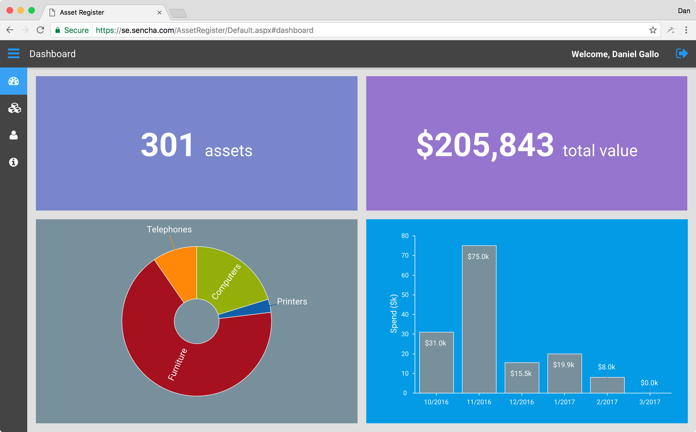

# Lab 1: Sample Application

**Total Time: 5 minutes**

## Asset Register app

Throughout this set of labs, you will be using a sample application called **Asset Register**. 

The Asset Register app enables a company to maintain a registry of all the assets it has purchased for its office.

### Technical details

This app has been built using the following technologies, to replicate a real-world application:

  * Sencha Ext JS 6.2 (Modern Toolkit)
  * .NET Web API (for RESTful APIs)
  * .NET Entity Framework (for communication with the database)
  * Microsoft SQL Server (for the database)
    
Applications created with the Ext JS 6.x Modern Toolkit support modern browsers, such Chrome, Edge and Internet Explorer 11.

### Multi-page app

Upon accessing the app, you are presented with a login screen that is separate to the page containing the Ext JS app:

After logging in, you are redirected to a page containing the Asset Register app. This is categorized as a multi-page app because the Login page redirects to the Ext JS app upon successful login:

### Create an account and login

1. Create a new account in the Asset Register app at https://se.sencha.com/AssetRegister/Register.aspx, using a valid email address.

 **Hint:** Choose a simple password that isn't used on other websites, as you will be storing this password in your test suite files later on.

1. After creating a new account, you will receive an activation email. Activate your account.

 **Hint:** The activation email will also contain a unique link that you can use during test runs that will reset the sample data for that user account.
 
1. Login to the application, and navigate through the different screens.

 **Hint** After logging in, your user account is pre-loaded with a set of sample data. Any changes you make to this data only affect your own user account, meaning test runs by multiple users won't impact each other.