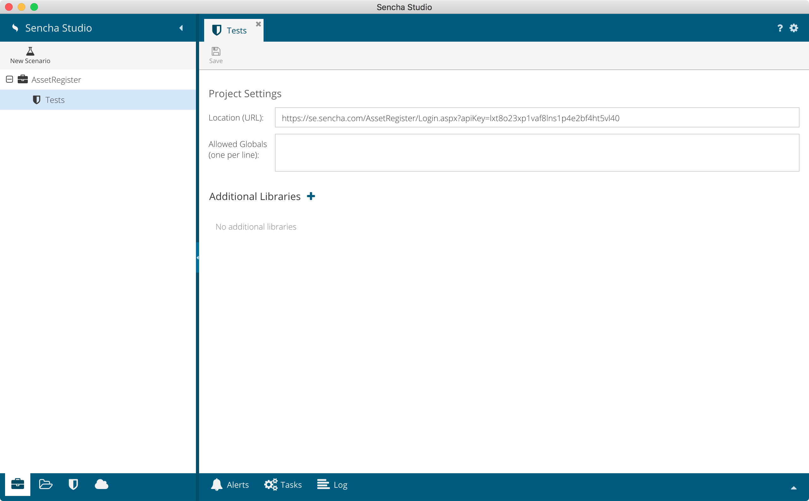

# Lab 2: Create a New Project

**Total Time: 10 minutes**

## Opening Sencha Studio

1. Launch Sencha Studio. 

1. The first time you start Sencha Studio, you will be asked to choose a role. Select **Test Engineer**.

  **Hint:** Selecting the Test Engineer role hides some of the more advanced options within Sencha Studio, and will default to the Code Tree view, instead of the Code view. It is possible to change the selected role in the future by going to the Preferences menu.

## Creating a New Project

1. You'll then be able to create a **New Project**. Enter the following details, making sure to replace the `apiKey` parameter with your own:

  * Name: Asset Register
  * Path: *Choose a folder on your local disk*
  * URL: `https://se.sencha.com/AssetRegister/Login.aspx?apiKey=your_key_here`

1. After creating the new Project, you will see a tree containing a Tests node, with Project Settings displayed to the right:

  
  
## Creating a New Scenario

You now need to add a new Scenario.

1. Click on the **New Scenario** button and type in a suitable name. We're going to focus
  on creating End-to-End tests in these labs, so enter the name `End-to-End`, and click `Save`. You will then have a new Scenario added in the tree:
  
  
  
## Creating a New Test Suite

The last item to add is a Test Suite. A Test Suite is essentially a single `.js` file containing your Jasmine tests.

1. With the Scenario selected in the tree, click on the **New Test Suite** button, and select `Jasmine Test 
  Suite`. As we're going to be testing the Login page first, enter the name `Login`. Sencha Studio will 
  automatically append a `.js` file extension for you. After selecting the `Login.js` Test Suite in the tree, Sencha Studio will display the contents of the file:

  

## Folder and File Structure

When you create a Test Suite, Sencha Test adds this to the file system.

1. Open up Finder (Mac) or File Explorer (Windows) and browse to the directory you created 
  above.
  
1. Inside this directory, you should see a folder called `test`. Browse
  the contents of that folder.
  
1. You should see a folder within `test` called `End-to-End`, which matches
  the Scenario name chosen above.
  
1. Within the `End-to-End` folder, you will see the newly created `Login.js`
  Test Suite.
  
**Hint:** In a real-world environment, you would normally check-in the entire
project folder to a source code control system, so that your tests are properly 
managed, version controlled, and accessible to other team members.

## Next Steps

Proceed to the next lab: [Finding Component Locators](asset_register_lab_3_finding_locators.html).