# What's New in Ext JS 6.5.3

## Introduction

Ext JS 6.5.3 has a number of improvements and bug fixes to Grid, TreeGrid, Charts, and more. Below are the key changes to Ext JS framework.

You can read more about these updates [here](./release_notes.html).

## New SplitButton Component
Ext JS 6.5.3 adds SplitButton, a widely requested component, to the modern toolkit.  A SplitButton is similar to a menu button, but its arrow can fire an event separately from the default click event of the button. This can be used to display a dropdown menu that provides additional options to the primary button action and you can provide a custom handler that can provide the arrow click implementation.

## Grid Enhancements and Bug Fixes 
The Ext JS Grid is one of the most popular components and buffered store (or virtual store) helps you manage and seamlessly scroll through massive datasets. The various bug fixes and enhanced scrolling capabilities in Ext JS 6.5.3 provides a smooth scrolling experience with grouped grids, grid view options, grid with locked columns and more. The grid row expander is improved as well.

## NestedList Enhancements
The NestedList in modern toolkit provides an intuitive interface to navigate between nested sets and provides a clean interface for applications with limited screen real-estate. The NestedList has undergone major changes in Ext JS 6.5.3 with improvements in events such as activate, selectionchange, in multiple configs showBy, allowDeselect and more.

## Android 8 (Oreo) and Latest Chrome Browser Support 
Android 8 is the latest release from Android. Ext JS 6.5.3 provides compatibility with Android 8 so that your Ext JS applications work seamlessly with Android 8 based smartphones and tablets. Ext JS 6.5.3 has support for the latest released Chrome browser versions (Chrome 60-63) as well.

## Hundreds of Component Improvements and Bug Fixes 
Ext JS 6.5.3 includes multiple enhancements and bug fixes to Charts, Data View, Events, Widgets, List, Calendar, Panel, Pivot Grid, Grid Tree, Forms and more. Many of these were based on customer reported issues as well as issues found during extensive testing phases.

# What's New in Ext JS 6.5.1

## Introduction

Ext JS 6.5.1 includes multiple enhancements to Grid, Tree Grid, Pivot Grid, tabs, 
toolbars, forms, date panel, and more. Below are the key changes to Ext JS components.

These enhancements are accompanied by hundreds of additional bug fixes and 
overall improvements.

You can read more about these updates [here](./release_notes.html).

## Grid 

Ext JS Grid, along with the selectable config in Grid, now also support the Clipboard 
plugin. The Clipboard plugin supports multiple formats including html for rendered 
html tags, text, and raw for underlying field values based on dataindex and cell. 

Grids often need to show extra details that may not fit in a column's cell or 
header. Now, you can configure an overflow tip. When a cell in a grid has more text 
than fits, it will show an ellipsis. When a user hovers over that cell, it will 
show a tooltip with the entire text.

Number field validations and modified cell renditions have been improved in the grid as well. 

## Tree Grid

The Tree component is closely related to Grid and shares many of its features such 
as Grid plugins for editing content. With Ext JS 6.5.1, you can use the “Exporter” 
plugin to export selected rows in the tree grid along with the header and summary row.

## Tab Panels

Tab panels now support overflow scrolling, so your application can have multiple 
tabs that can be easily scrolled along with support for ripple and indicator 
animation. With overflow handler controls, you have complete control to 
enable or disable scrollbar visibility.

## Pivot Grid

The Pivot Grid aggregator functions now provide options that behave more like 
Excel. Your data sets can include null values, and you have the option to 
ignore null values, just like in Excel, using the property 
calculateAsExcel. The count numbers function of Excel is supported in both 
the Configurator as well as Exporter plugins.

## Date Panel

With Ext JS 6.5.1, we’ve made multiple styling improvements to the 
datepanel component including a rounded style for Selected date and 
Today’s date. There is also a UI mixin for datepanel that allows you to 
easily create custom themes.

# What's New In Ext JS 6.5.0

# Introduction

Ext JS 6.5 delivers numerous exciting new features for the modern toolkit as well as 
many improvements and enhancements for everyone. With its focus on the modern toolkit, 
this release represents a major version release for the modern toolkit combined with a 
normal feature release for the classic toolkit. While there are a few, small, breaking 
changes (detailed in the Upgrade Guide), overall there is just lots of new stuff to 
make your Ext JS applications even more awesome.

# What's New In The Modern Toolkit

Advancements in the modern toolkit are the main focus for this release. While the 
modern toolkit has always been "mobile first", with Ext JS 6.5, the modern toolkit is 
clearly not "mobile only".

The improvements cover all aspects of the toolkit from forms, to lists and grids, to 
dialogs and menus and more. Let's get started by diving into grids!

## Grid

The Grid and its base class List (coming up next), are among the most heavily relied 
upon components in Ext JS applications and consequently they have gained the most in this release.

### Selections

One immediate benefit to all grids is that you can now allow users to select rows, 
cells or columns in a manner very similar to Microsoft Excel. Each of these selection 
modes is now configurable using the simple new `selectable` config. This config provides 
all the capabilities found in the classic toolkit's spreadsheet selection model.

A couple examples should illustrate:

    items: [{
        xtype: 'grid',
        
        selectable: {
            cells: true,
            columns: true,
            drag: true,
            rows: true
        }
    }]

These settings allow the user to make all kinds of selections in the grid. For example:

To just use a checkbox to select rows, change selectable to only include those properties:

    items: [{
        xtype: 'grid',

        selectable: {
            checkbox: true,
            rows: true
        }

    }]

As the user selects cells, rows or columns, various events are fired to allow your 
application to monitor these changes and take the appropriate actions.

### Cell Editing

The `grideditable` plugin is now joined by the `gridcellediting` plugin. The `grideditable`
plugin is a good choice for a mobile user since it provides a modal form to edit the 
fields of a row that slides in from the side. For desktop users, however, inline cell 
editing is often a better choice and this is now available in the `gridcellediting`
plugin. As with `grideditable`, the form field to use is configured with the column's 
`editor` config:

    items: [{
        xtype: 'grid',

        plugins: {
            gridcellediting: true
        },

        columns: [{
            text: 'Name',
            dataIndex: 'name',
            editor: 'textfield'
        },
        ...]
    }]

To provide an editing experience adapted to the current platform, you can
select which of these plugins to use with `platformConfig`:

    items: [{
        xtype: 'grid',

        platformConfig: {
        
            desktop: {
                plugins: {
                    gridcellediting: true
                }
            },

            '!desktop': {
                plugins: {
                    grideditable: true
                }
            }
        },
        ...]
    }]

To configure plugin options just replace the true value with a config object. The 
plugin type will be known by the property key and does not need to be specified. Since 
both plugins use the column's `editor` config, there will likely be no additional, 
platform-specific configuration needed.

#### Cell Editing Superpowers

By default, while editing a cell on a row, the cell editor plugin will prevent that 
row from scrolling out of view. The row will automatically be pinned to the top or 
bottom of the grid when the row would normally be above or below the visible area.

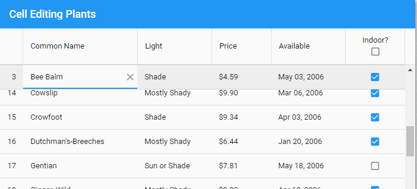

While editing you can navigate to the next and previous cells using TAB and Shift+TAB. 
In fact, as part of cell editing, most of the actionable mode spec for keyboard 
interaction is supported in this release.

### Grid Tools

Panels were the first place `tool` components (a minimal, icon-only button) made their 
initial debut:

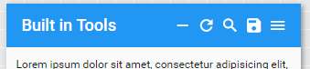

With Ext JS 6.5, tools can go many more places... in particular, grids and lists!

#### Cell Tools

Probably the most commonly desired place for tools to appear is grid cells:

    columns: [{
        ...
    }, {
        width: 70,

        cell: {
            tools: {
                approve: {
                    iconCls: 'x-fa fa-check green',
                    handler: 'onApprove'
                },
                decline: {
                    iconCls: 'x-fa fa-ban red',
                    handler: 'onDecline',
                    weight: 1
                }
            }
        }
    }]

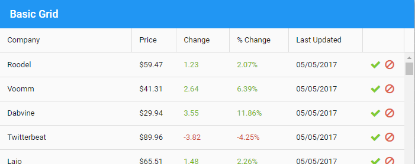

So far this looks like the classic toolkit's action column. All cells can have tools, 
however, even if they have other content such as a simple `dataIndex` value. To control 
the presentation in this case, the tool can be assigned a `zone`. By default, tools use 
the "head" `zone` which is attached to the front of the cell content.

    columns: [{
        text: 'Name',
        cell: {
            tools: {
                pin: 'onPin'
            }
        }
    }, {
        text: 'Cuisine',
        cell: {
            tools: {
                gear: {
                    handler: 'onSettings',
                    zone: 'end'
                }
            }
        }
    }, {
        ...
    }]

In total, there are four zones for cell tools: "head", "tail", "start" and "end". The 
"head" and "tail" zones attach the tool to the cell content and are affected by content 
length as well as alignment. Conversely, "start" and "end" are always at the left or right 
edge of the cell, respectively.

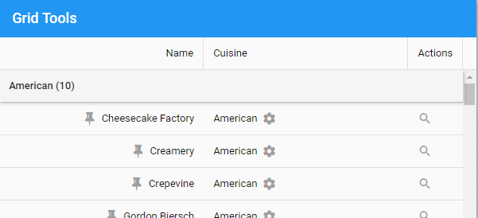

#### Column Tools

Column headers can also contain tools. For example you can make configurable columns by
adding a gear to the column header like so:

    columns: [{
        text: 'Company',
        tools: {
            gear: 'onCompanySettings'
        }
    }, {
        ...
    }]

Column headers support the same four zones for tools, but default to the "tail" zone as 
shown above.

#### Group Header Tools

When you apply a grouper to the store, the group header and its pinned variety can be
used to contain tools as well. These tools would be useful for providing actions that
operate on entire groups of records. The tools are specified on the groupHeader config
like so.

    groupHeader: {
        tools: {
            print: {
                handler: 'onGroupPrint',
                tooltip: 'Print group',
                zone: 'tail'
            },

            save: {
                handler: 'onGroupSave',
                weight: -1
            },

            refresh: 'onGroupRefresh'
        }
    }

#### Tree Cell Tools

Placing tools on the tree cell works as you would expect with only one difference. In a 
tree cell, the default zone is "tail". For example:

    columns: [{
        xtype: 'treecolumn',
        text: 'Name',
        dataIndex: 'text',
        flex: 1,
        cell: {
            tools: {
                gear: 'onChangeSettings'
            }
        }
    }, {
        ...
    }]

The above will add a gear tool following the text of each tree node:

### Column Menus

Grid columns now provide popup menus that can be used to change sort direction and control 
grouping (as in the classic toolkit).

The column menu can also be easily customized in the column definition:

    columns: [{
        text: 'Company',
        dataIndex: 'name',

        menu: {
            custom: {
                text: 'Custom Item',
                separator: true,
                handler: 'onCustom'
            }
        }
    }, ...

The above snippet illustrates a couple other exciting features in this release. These 
are popup menus (obviously) and "weighted" containers. We've already seen weighted 
containers for tools, but more on each of these later.

### Virtual Stores

To deal with massive (or just potentially massive) data sets, grids and infinite lists 
can use the new virtual store (`Ext.data.virtual.Store`). Unlike a normal data store, a 
virtual store only fetches the pages needed by the view(s) using it. Those familiar with 
the classic toolkit grid will recognize that this is the same functionality provided by a 
buffered store (`Ext.data.BufferedStore`). The inner workings and the public API of the 
buffered store are, however, quite specific to the inner workings of the classic 
toolkit grid. The modern toolkit grid (and list) have very different requirements. So 
rather then break these public API's, the virtual store was born.

From a high-level perspective, there is little difference between a virtual store and a 
buffered store. Both hold only the portion of the data set needed for display 
(plus some nearby pages as a cache). Both request pages of records using the 
standard means of the data package, meaning that server-side handling is the same. It 
is only when you look at the details of the virtual store API that the differences come out.

Some of these differences are:

 * Shareable with multiple views
 * Synchronous access to available records
 * Callback to inform the view as missing records become available
 * Manages remote group summaries delivered by page loads

#### Active Ranges

To manage the needs of its client views, a virtual store tracks a set of 
*active ranges*. These are just objects (`Ext.data.virtual.Range`) created like so:

    var range = store.createActiveRange({
        prefetch: true,
        callback: 'onRangeUpdate',
        scope: this
    });

    range.goto(1000, 1050);

    var rec = range.records[1000];
    if (rec) { ...

The above code creates and configures a range and then directs it to the desired records 
using their index in the data set. The prefetch option tells the virtual store to load 
pages adjacent to the range specified in the `goto()` call.

The `records` collection is indexable (at all times) using the absolute record index, even 
if that number is very large. This is because, for a virtual store, `records` is not an 
array but an object and so it is not fully populated.

The important thing to remember with a virtual store is that not all records are present 
at any given point in time. That is to say, the `if (rec)` test is essential. To complete 
the circuit, as new records become available in `range.records`, the callback is called 
with the details.

The difference between virtual and non-virtual stores is minimized since all stores 
(except buffered) implement `createActiveRange`. These stores simply provide read-only 
access to their array of records as `range.records` and ignore the prefetch option.

These techniques add up to greatly streamlined code paths in critical areas such as 
responding to scrolling by populating and adjust rows just in time.

### Row Operations

A very common mobile idiom for manipulating rows of information is to hide the
selection tool until it is needed. The `rowoperations` plugin provides this capability.

`rowoperations` is the renamed and revamped update to the MultiSelect plugin in previous 
versions. `rowoperations` allows you to customize the operation(s) you want to perform on 
the selected records. It can also disable selection visibility when not in selection 
mode. That is, clicking on rows does not change their background to selected.

### Grouping

There are a collection of enhancements to the grouping abilities of lists and grids. For 
starters, much more information is presented to the `tpl` config of the `groupHeader`. This 
template now has access to numerous useful bits of information about the group, 
including access to the group itself.

In addition, there are now column-level configs that can be applied when the grid is 
grouped by that column. Columns can now provide a custom `grouper` that will be passed to 
the store when the user asks to group by that column. Columns can also supply a 
`groupHeaderTpl` config to be used instead of the normal `tpl` for the `groupHeader`.

### Group Summaries

There are also many improvements and new features in the realm of summaries. For 
starters, the grid's `summaryrow` component can be added as the `groupFooter`:

    groupFooter: {
        xtype: 'gridsummaryrow'
    },

The above (plus some pieces we'll see in a moment) produce the summary row with an 
average Rating between the last row of the "American" group and the header of the 
"Asian" group:

Columns have numerous configs that can be used to configure their cells in summary 
rows and the content of those cells.

* summary

* summaryCell

* summaryDataIndex

* summaryFormatter

* summaryRenderer

The `summaryCell`, `summaryDataIndex`, `summaryFormatter` and `summaryRenderer` are the 
counterparts to `cell`, `dataIndex`, `formatter` and `renderer` configs for normal rows.
In most cases these configs are applied to both summary and normal rows, but there are 
many cases where these need to be adjusted for presenting summary

The `summary` config allows a column to specify how data should be aggregated or 
summarized. This config holds the name of a summarizer (such as "average", "min", 
"max", "sum"). This config is equivalent to the `summary` config on the data model layer.

#### Model Summaries and Summary Models

Calculating and managing summaries for groups and whole stores can now be automated 
in your data models. These can now be requested using the `getSummaryRecord` method on 
stores and groups.

Consider a model for an Employee that has a salary field. By adding a summary config 
to the salary field we can indicate how that field should be processed when 
calculating summaries.

    Ext.define('App.model.Employee', {
        extend: 'Ext.data.Model',
        fields: [{
            name: 'salary',
            summary: 'average'
        }]
    });

We can also define additional summary fields:

    Ext.define('App.model.Employee', {
        extend: 'Ext.data.Model',
        summary: {
            maxSalary: {
                field: 'salary',
                summary: 'max'
            }
        }
    });

These definitions are used to populate the fields of a derived class called the 
"summary model". An instance of this class is created to hold summary values when 
loading from a remote source or just being calculated locally. In grid summary rows, 
these summary records (instances of the summary model) are consulted using the `dataIndex`
(or `summaryDataIndex`). The column's `summary` and `summaryRenderer` configs can be used to 
determine a value outside the data layer but defining summaries at this lower-level can 
save a lot of repetition.

While these data level features are available to the classic toolkit, the classic grid's 
grouping plugin has not been updated to use summary models. It still performs grouping 
calculations as it was in previous versions.

### Pinned Footers

By default, infinite grids and lists will automatically pin group headers as seen above. 
That way the user can always see the group heading at the top of the grid as they 
scroll. The same can now be applied to group footers:

    pinFooters: true,
    pinnedFooter: {
        xtype: 'gridsummaryrow'
    },

In most cases the `pinnedFooter` config will be the same as the `groupFooter`. For grids 
the `gridsummaryrow` component (`Ext.grid.SummaryRow`) is the normal choice.

With the pinned footer in place the user can now always see the summary of the last 
visible group at the bottom of the grid.

### Rating Component

The Rating column in the above examples demonstrates the `rating` component 
(`Ext.ux.rating.Picker`) that was previously available only in the classic toolkit. The 
rating component is an easy way to display a series of glyphs (typically stars) to 
represent a value similar to the slider.

### rowNumbers

The new `rowNumbers` config automates the declaration of a `rownumberer` column in your 
columns config. This makes it much simpler to retain this column if the others in your 
grid change dynamically since you will no longer have to juggle the additional column.

## List

Next to grids, lists are probably the most heavily used component in most applications. On 
mobile, lists are even more prominent, and so we've given lists a lot of attention and 
improvement. Many of the features mentioned for grids are in fact list features that 
grid simply inherits. Things like virtual stores, group footers and pinned footers are 
actually properly features of list. While virtual stores and pinned headers/footers are 
only available when the infinite config is enabled, normal group headers and footers are 
available in all lists.

### List Item Swiping

A common list interaction in mobile applications is the ability to drag an item from 
side-to-side to perform some action upon it like "archive" or "delete". There are two 
ways this interaction typically takes place as you drag: all options are presented or 
only one option (at a time) is presented.

The new `listswiper` plugin supports both approaches.

#### Accordion

To present all available options at the same time is called the "accordion". Adding the 
plugin to a list is much like declaring a toolbar:

    plugins: {
        listswiper: {
            defaults: {
                width: 48
            },

            right: [{
                iconCls: 'x-fa fa-envelope',
                ui: 'alt confirm',
                commit: 'onMessage'
            }, {
                iconCls: 'x-fa fa-phone',
                ui: 'alt action',
                commit: 'onCall'
            }, {
                iconCls: 'x-fa fa-trash',
                ui: 'alt decline',
                commit: 'onDeleteItem'
                undoable: true
            }]
        }
    },

With the above plugin defined, the user can now drag list items like so:

Actions can be placed on both sides or only one as shown above. If the item is swiped 
sufficiently far and released, the item will park itself such that all of the 
buttons will be fully displayed. The user can then decide to tap one or they can 
resume dragging the item. In this open state, the `dismissOnScroll` and `dismissOnTap` 
config can be used to decide what actions should return the item to normal.

When an action button is tapped or if the drag was large enough to trigger the default 
button, the `commit` method is called (typically implemented by the view's controller).

Actions can also be undoable, but more on that later.

#### Stepper

To present one action at a time, the `listswiper` plugin can be directed to a different 
component for presenting the actions:

    plugins: [{
        type: 'listswiper',
        widget: {
            xtype: 'listswiperstepper'
        },

The left and right configs are essentially the same as before, but not the user 
interaction looks like this:

#### Undoable Actions

It is often desirable to give the user the option to undo these gestures and the 
`listswiper` provides all the hooks necessary to manage these more complex 
operations. Normally when an action is selected its `commit` method is called. When an 
undoable action is selected, it instead calls the optional `precommit` method and then 
displays the Undo prompt.

While the Undo prompt can be customized, this is its normal appearance:

There are now two basic paths for the user to take. The first is the Undo button. If the 
user taps Undo, the revert method will be called. All other ways to dismiss the Undo 
interface will result in the commit method being called. In other words, `precommit` is 
called when the user selects the action and then either `commit` or `revert` is called 
depending on how the Undo prompt was dismissed.

In the same way that the `dismissOnScroll` and `dismissOnTap` configs control closing a swiped 
item, they also determine whether these gestures will dismiss the Undo prompt. Since the 
Undo button was not used to dismiss the item, the `commit` method will be called.

Another way for the prompt to be controlled is the `commitDelay` config. This config will 
dismiss the Undo prompt after is has been displayed for a certain amount of time. When 
this time elapses, again the `commit` method is called.

While the method names `precommit`, `commit` and `revert` imply their intended purpose, they 
can of course be used to perform any actions necessary. For example, the simplest way 
to implement an undoable Delete action is to simply put the logic in the `commit` method 
as you would for a normal action. From the user's perspective, the item looks deleted once 
they select that action, but if they select Undo then nothing actually happens.
Alternatively, you could perform the delete in the `precommit` method and then 
also implement the `revert` method. Obviously this approach is more complex but may be 
necessary if the effects of the delete need to be immediate.

#### Grid Rows

Because Grid extends List, this plugin works on grid rows as well as list items.

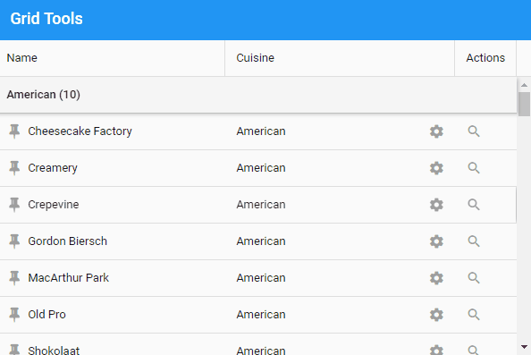

While combining the `listswiper` with a grid that has horizontal scrolling is not a 
recommended user experience, there are many simple grids where this plugin can be 
quite useful.

### Tools

As with grids, list items can now contain tools. In prior releases, there was only the 
option for a disclosure tool but now you can add any tool to your list items.

### Auto-Height and Infinite Lists

In previous releases, infinite lists (and grids) had to be given a height by some 
external means. Perhaps by a box or fit layout. In Ext JS 6.5, these can now operate on 
the maxHeight instead if one is specified. In this case, the infinite list will only 
acquire the height necessary to fully contain its items if that is less than the configured 
maxHeight. This is particularly useful when using popup lists that may contain a very 
large number of items… or perhaps just two.

### Pull Refresh

The pullrefresh plugin has been updated so that all presentation modes are available to 
any theme. In the previous release, the floating spinner style was built into the 
material theme and so was unavailable in any other theme, and conversely the info 
bar was not available in material theme.

To stick with the default choices for your theme, simply add the plugin:

    plugins: {
        pullrefresh: true
    }

The default settings will produce the same result for each theme, but now you can 
configure the widget to use for the presentation.

To use the material spinner:

    plugins: {
        pullrefresh: {
            widget: 'pullrefreshspinner',
            overlay: true
        }
    }

To use an overlay info bar:

    plugins: {
        pullrefresh: {
            widget: 'pullrefreshbar',
            overlay: true
        }
    }

To use the inline info bar:

    plugins: {
        pullrefresh: {
            widget: 'pullrefreshbar',
            overlay: false
        }
    }

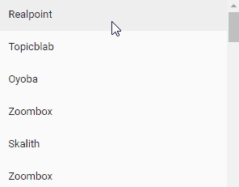

There are other settings for the pullrefresh plugin, like mergeData that 
determines if the refresh replaces the current records or only adds new ones.

## DataViews

It is easy to forget that some important functionality of list and grid actually 
comes to them from their dataview base class. The new associatedData config could 
easily go unnoticed for this reason, but that would be unfortunate because it is 
particularly useful for grids.

The associatedData config is used to limit the amount of data gathered from 
associations. The default value is true, which means to gather all available associated 
data and present it, along with the data fields, to the itemTpl, or the tpl for grid cells.

To see how associatedData works, consider a grid that displays a store of Order 
records. The Order has an association for orderItems that describes the items in the 
order as well as several other associations (such as multiple Address associations 
for shipping, billing, etc.). Each cell's tpl will be presented with an object 
containing the Order's fields, and child objects for all associated items such as an 
array of objects for the orderItems. If no cell tpl needs this information, we can 
save time and disable associations:

    associatedData: false

If  we only need the shippingAddress association, we can say something like this:

    associatedData: {
        shippingAddress: true
    }

Now the data gathering will be limited to the record's data fields and the data for the 
associated shippingAddress. This same underlying feature will appear again later for 
nested writing!

## Forms and Fields

The forms package has gained a number of major improvements and some brand new 
components as well.

### Validation

Perhaps the most important enhancement to the field component family is the validation 
system. This support starts at the "bottom" with the new error and errorTarget configs on 
`Ext.field.Field`. The validators config then allows you to succinctly express the 
rules that determine the field's validity. The validator results are used to set the 
field's error config.

#### errorTarget

By default, the errorTarget is set to "qtip" which means you have to hover the field to 
see the tooltip:

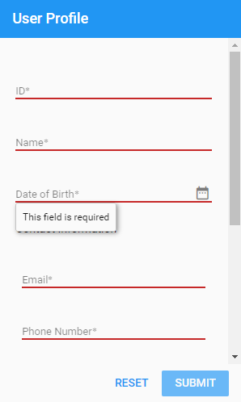

You can also specify "bottom" or "side" as the errorTarget. The "side" target will 
display an icon on the right side of the field when the field is invalid. Hovering or 
tapping that icon will display the error message.

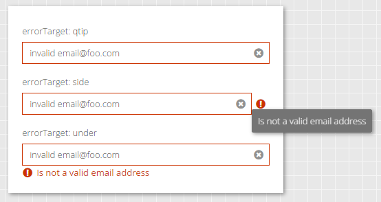

There are other options for displaying the error message that you can learn more about 
in the API documentation.

#### validators

The validators config allows you to add one or more rules to a field that will be 
automatically checked when the value changes.

For example:

    {
        xtype: 'urlfield',
        label: 'Homepage',
        validators: 'url'
    }

You can have multiple validators as well as provide config options:

    {
        xtype: 'urlfield',
        label: 'Homepage',
        validators: [
            'url',
            { type: 'length', max: 140 }
        ]
    }

#### Empty Values

When there is no value, the field's required config or a presence validator will 
be used to determine validity. Only when there is a value will other validators be 
tested. This means the above Homepage field is not required and will therefore accept 
an empty value.

### Input Masking

Providing a visual assist for editing textfields has been a popular feature request 
for some time, and now with Ext JS 6.5 the inputMask has arrived. This is currently 
only available in the Modern toolkit for now but Classic will catch up soon.

To use this config, you need to require Ext.field.InputMask. This approach is similar 
to the new panel features and helps keep build size down for unused features. Once 
this class is required, you can add inputMask to any textfield like so:

    {
        xtype: 'textfield',
        label: 'Phone Number',
        placeholder: '(xxx) xxx-xxxx',
        inputMask: '(999) 999-9999'
    }

The above yield the format mask "(___) ___-____" which is inserted when the user 
focuses the field. Only valid characters for the cursor position are accepted while the 
mask is preserved.

The numbers '0' and '9' serve as wildcards that will accept any digit. Similarly 'a' or 
'A' will match any letter and '*' will match any alphanumeric character. All other 
characters are considered part of the format mask.

### Floated vs Edge Pickers

When developing for multiple devices it can be difficult to get the user experience 
right for all situations. One of the most glaring differences between mobile and desktop 
UX are what Ext JS calls picker fields like datefield. On mobile, the expected interface 
when editing such fields is typically a modal attached to the bottom of the screen. The 
desired experience for a desktop user is completely different.

The solution provided by Ext.field.Picker comes down to three configs: picker, 
edgePicker and floatedPicker. The picker config is generally set by the framework, 
based on the device type, to either 'edge' or 'floated'. This value then determines 
whether the edgePicker or floatedPicker config will be used to create the 
necessary components.

Normally then you would use the edgePicker and floatedPicker configs to determine how 
each experience should work and then the right one will be used automatically. Of course, 
you can also set the picker config directly and bypass the normal device-detection.

### Date Field and Panel

The datefield component uses the above picker controls to create a datepanel as the 
floated picker and a datepicker as the edge picker. The datepicker will be familiar 
from previous releases, but the datepanel is new in Ext JS 6.5.

The datepanel presents one or more calendar months from which the user can select the 
desired date. The datepanel can be configured to display multiple months in a carousel 
arrangement as well:

And of course, the datepanel can be created and used outside of a datefield.

### ComboBox

The combobox is a selectfield with many additional features. The biggest difference is 
that, unlike a selectfield, the user can type into a combobox. As the user types the 
contents of the associated store is filtered.

The forceSelection config is the second major difference. This config determine how the 
value of the combobox is handled. The default value of false causes the combobox to act 
more like a textfield and allows the user to type whatever they want as the value. Setting 
this config to true requires that the user pick an item found in the store.

### Forms

The formpanel (Ext.form.Panel) class that manages an HTML form has gained extra 
functionality to help manage errors for the fields it contains. It has also been 
refactored into some reusable since as the new fieldpanel (Ext.field.Panel) base class 
and the Ext.field.Manager mixin.

The fieldpanel can be used in most places where a formpanel is used currently. The 
major difference is that because a fieldpanel is not an HTML form element, it does 
not have a submit method. This is also one of its key advantages. While Ext JS allows 
you to nest formpanel's (and therefore their form elements), this is actually disallowed 
by the [HTML5 Content Model](https://www.w3.org/TR/html5/forms.html#the-form-element). Now 
with fieldpanel, there is no reason to do so any longer.

All of the field management features and some new ones have been gathered in the 
`Ext.field.Manager` mixin. These methods arrive on formpanel by being mixed into 
fieldpanel, but are also available on containerfield (Ext.field.Container).

#### name

In the world of forms, fields often need to provide a name config to set their HTML 
name attribute. To simplify managing fields in a controller there is the new `lookupName()` 
method that works like the reference config and lookup() method. Unlike reference, 
however, a name can be marked as shared using shareableName. In this case the `lookupName()` 
call will return an array of components with the given name.

### Form Layout

In many desktop forms it can be difficult to assign proper label widths. This is 
especially true if those labels can be localized. The form layout allows you to 
sidestep this issue and let the fields automatically adjust to their labels:

The first form simply declares its layout and labels its fields:

    xtype: 'formpanel',
    layout: 'form',
    items: [{
        xtype: 'textfield',
        label: 'Short'
    }, {
        xtype: 'textfield',
        label: 'Tiny'
    }]

The major limitation with the form layout is that is uses CSS display table and 
table-cell to drive the label width. This makes it suitable for simple forms like 
these but not for more complex forms.

## Menus

Popup menus come in handy at times on mobile but are essential for desktop 
applications. The Ext.Menu class from previous releases was really just an 
`Ext.ActionSheet` and so it has been removed to avoid confusion with the new 
menu component family (Ext.menu.*). The menu family has components like menuitem, 
menucheckitem and menuseparator. Of course, menuitem has a menu config for sub-menus 
as does the button component.

Another useful config on menuitem is separator. This boolean config allows you to 
associate a separator above the menuitem in such a way that it will never be 
orphaned. Orphaned separators are the bane of dynamic menus and the separator config 
can be really helpful in avoiding them. An orphaned separator is a separator that 
appears at the very top of the menu (say if the previous item was hidden or removed) or 
stay behind when the item they were separating was hidden or removed.

Compare the menu config using an explicit menuseparator component:

    items: [{
        // ...
    }, {
        xtype: 'menuseparator'
    }, {
        text: 'Simple check item',
        checked: false
    }, {
        // ...
    }]

   

To the menu config using the separator config:

    items: [{
        // ...
    }, {
        text: 'Simple check item',
        checked: false,
        separator: true
    }, {
        // ...
    }]

Not much different, but now if that menu item is hidden or removed, the separator 
above it will be removed as well. Since the item below it also has a separator, this is 
the kind of thing that would lead to two adjacent separators.

Menus also set the new weighted config to true to enable more declarative menu creation. This 
is especially helpful for grid column menus that are produced by merging the grid's 
columnMenu config with the column's menu config.

## Weighted Containers

In most containers the items config is defined as an array. This is ideal for lots of 
simple cases, but at times it presents a challenge to declaratively intervene and remove 
or adjust the properties of some member of that array. Declaratively adding to items is 
also problematic. The first place the solution to this problem was applied was 
`Ext.panel.Header` specifically because of its need to compose the items of that 
container from the panel's header, title and tools configs. The same approach was used 
for the triggers of a textfield, but those are not managed in an Ext.Container.

With Ext JS 6.5, this ability has been refactored and made available to any 
`Ext.Container` via the weighted config. When this config is set to true, the items 
can now be supplied as an object instead of an array. This can be seen in action in 
Grid's columnMenu config:

    columnMenu: {
        xtype: 'menu',
        items: {
            sortAsc: {
                xtype: 'gridsortascmenuitem',
                weight: -100 // Wants to be the first
            },
            sortDesc: {
                xtype: 'gridsortdescmenuitem',
                weight: -90 // Wants to be the second
            },
            //---------------------------------
            // Columns menu is inserted here
            //---------------------------------
            groupByThis: {
                xtype: 'gridgroupbythismenuitem',
                separator: true,
                weight: -70
            },
            showInGroups: {
                xtype: 'gridshowingroupsmenuitem',
                weight: -60
            }
        }
    }

The keys of the items object become the itemId of the component and the items are 
sorted by their weight property. The advantage here is that if the column's menu config 
is also an object, these will be automatically merged by the config system. Should any of 
the keys be set to null, that item will simply be removed.

After the merging and the sorting is done, the items array will looking something 
like this:

    items: [{
        xtype: 'gridsortascmenuitem',
        itemId: 'sortAsc',
    }, {
        // ...
    }, {
        xtype: 'gridshowingroupsmenuitem',
        itemId: 'showInGroups'
    }]

Weighted containers were created for triggers and panel tools, but now are open to all as 
a powerful and flexible way to declare containers. They open new architectural options for 
writing base classes for views that can declare items and still allow derived classes and 
finally the instantiator to contribute details at almost any depth.

### Named Plugins

The weighted container enables the items config to be much more declarative so to go 
along with that approach the plugins config can now also be an object of named plugins. In 
fact, in many examples above we've been using this new syntax. Perhaps the most interesting 
is for cell editing:

    platformConfig: {
        desktop: {
            plugins: {
                gridcellediting: true
            }
        },

        '!desktop': {
            plugins: {
                grideditable: true
            }
        }
    },

By using named plugins like this, the plugins config on the class body will be merged 
with whatever matches the platform criteria. In the end, you can easily overlay all 
kinds of configs (even items and plugins) using platformConfig, inheritance and the 
final instance config to get exactly the right combination for the situation... without 
any array splicing logic!

## Panels

The panel component is a widely used container because of its decorative capabilities. In 
Ext JS 6.5 these capabilities have grown considerably. From simply things like panel 
header rotation to some simple convenience configs like tbar (from the Classic toolkit), 
panels have grown even more useful.

### Resizing

Providing a way to directly manipulate the size of a component is essential in desktop 
applications where space is often shared between multiple "regions". The new 
`Ext.panel.Resizer` class (once required by the application) adds a resizable 
config to `Ext.Panel`. This config is used to create and configure a resizer instance.

The "Dock Top" component is simply configured to be resizable:

    resizable: {
        split: true,
        edges: 'north'
    }

The resizer's split config can be removed and the resizer handle will simply overlap 
the bottom edge.

### Collapsing

To really make room we need another technique. In the Classic toolkit, panels have a 
collapsible config which is now provided in the Modern toolkit by the Ext.panel.Collapser 
class. As with the Ext.panel.Resizer class, simply requiring Ext.panel.Collapser will add 
configs to panel. In this case, collapsible and collapsed. The collapsible config can 
simply be true or it can be a config object for the Ext.panel.Collapser instance.

There are lots of configs on the collapser, so definitely check it out in the docs, but 
perhaps the most interesting is the drawer config. The drawer is the component that 
"floats" out when you tap the collapsed header but not the expand tool.

The collapser can also be configured to fully animate the collapse rather than to 
take the panel out of the flow as above. This would be appropriate for accordion 
arrangements for example.

## Dialog

While panels can do a tremendous amount, there is a cluster of functionality that is 
better served as a derived class: popups and modals. The Classic toolkit provided a 
window component but that name can be ambiguous with the browser's global window object 
and so the name Ext.Dialog was chosen for the Modern toolkit counterpart.

A dialog is a panel that is centered, draggable, floated and modal (by default). In 
addition, dialog adds the maximizable config and some refinements to processing 
the buttons config it inherited from panel.

### buttons

The buttons config (defined by panel) populates a weighted toolbar called the 
buttonToolbar. Being a weighted container, buttons can be merged with the standardButtons 
config that defines the text and weight for the most common buttons used by applications. This 
enables application code to be as simple as this:

    buttons: {
        ok: 'onOK',
        cancel: 'onCancel'
    }

Since the text and weight come from the standardButtons, these can now be more readily 
localized and also corrected for a key platform difference: the order of OK and Cancel. This 
(long) debate can be boiled down to this: Apple platforms want Cancel first and pretty 
much every other platform wants OK first. Since the goal is to provide the optimal user 
experience for the end-user, standardButtons assigns weights based on the current 
platform's standards.

### Handling ESC and X (Close)

A common pitfall when implementing most popups is to forget that the Cancel button and 
all its workflow of confirmations and acknowledgements will only happen when the user 
clicks the Cancel button. The ESC key and the close tool (X) often go down different 
routes. These are easily corrected once identified, but it would be best if this 
multipath shutdown weren't the default in the first place.

To make this the case, dialog has an array (dismissAction) of common button names 
(e.g., "cancel") that should be considered equivalent to ESC/X. When ESC or X arrives, the 
buttons config is checked for a matching button in the dismissAction array. If there is a 
match, that button is triggered as if the user had pressed it.

## Component and Container

At the core of it all for the Modern toolkit is Ext.Component and Ext.Container. There 
are a few enhancements at this low-level that are important.

### onRender

The first thing to note is that there is now an onRendered() template method for 
components. This method is called when a component is first added to the DOM. This is a 
bit different than the same named method in the Classic toolkit, but largely similar. In Modern, components have their elements created immediately so they can be used at any time (prior to being destroyed). The element tree of a component is not, however, immediately present in the DOM and hence cannot be measured or queried for styles. While these actions are not needed in most cases, and should be avoided unless necessary, the onRender method is the optimal answer when they are needed.

#### Data Binding

The final act of wiring ViewModels to their parent is now handled in onRender. This was 
previously performed at construction time. This prevented view model inheritance if 
components were created and then added to their container since a view model's parent 
cannot be changed after creation.

### Draggable

The draggable config now configures an instance of the Ext.drag.Source class in the 
new drag-drop system. In previous releases this config was implemented in a private way 
and basically only the value true had a defined meaning. Now you can do all kinds of tricks 
with draggable based on the drag system.

### autoHeight

It is now easier than ever to get panels and other containers to size to their 
content. In fact, the new autoHeight config is on by default. There is an important 
qualification, however. The CSS necessary to make height "just work" can run into 
a [long-standing](https://bugs.webkit.org/show_bug.cgi?id=150445) and only very 
recently [fixed](https://bugs.webkit.org/show_bug.cgi?id=168657) performance issue 
in Safari.

Because the problem only affects some nesting situations and the fix will roll out 
over the next few months, the decision was made to favor correctness instead of the 
(short-lived) potential for a performance issue.

If you are seeing a performance gap on those platforms, we recommend the following 
override to change the default autoSize to false:

    Ext.define(null, {
        override: 'Ext.Container',
        autoSize: false
    });

Once the setting is changed, make sure to find and add autoSize:true to any containers 
that actually need it. If Safari and iOS are a critical target for your app, you could 
just start with this override of course.

## Theming Enhancements

There are number of improvements to the themes and theming API's to be excited about. The 
biggest change you'll notice if you have an Ext JS 6.2 app is that focus styling is now 
dynamically conditioned by whether the user is tapping or typing. This is how browsers 
natively decide to show focus on things like buttons, so users will find it quite 
natural. Mouse and touch users will not be bothered by focus indicators while 
keyboard users that need them will see them. If you switch back-and-forth, the 
indicators will come and go based on the most recent device used.

### More Choices

All themes now have focus, hover and pressed styles and variables to control them. 
Buttons and text fields have new ui's to help them better fit in places such as 
panel headers.

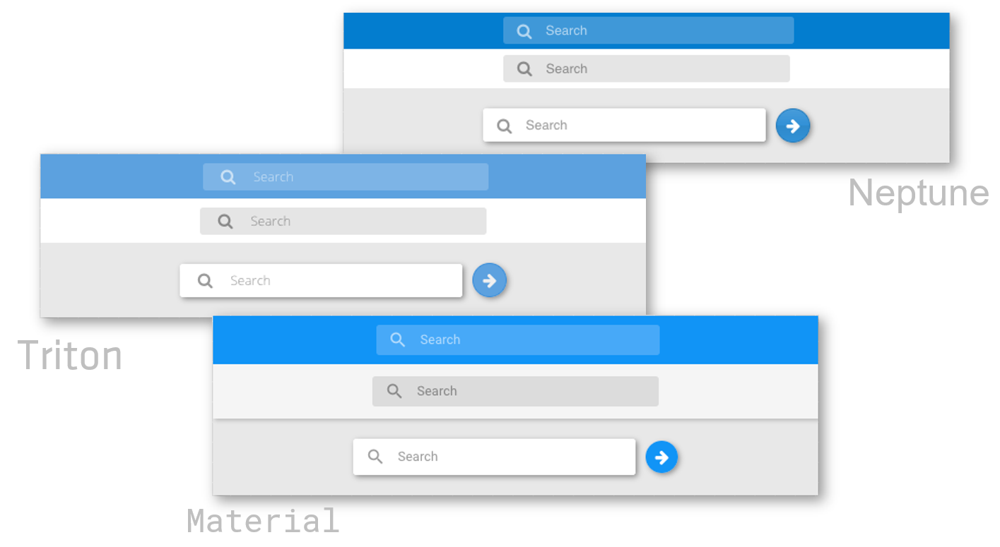

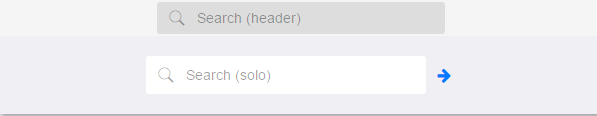

### iOS

Buttons use the new ui ("alt") for placement on a panel header or title bar. The 
alt ui can also be combined with other button ui's like action or confirm.

The treelist component's new "nav" ui makes it a snap to get a good looking 
navigation tree, so you won't have to copy that code from the Admin Dashboard to 
start your next app!

### Material Theme

Of all the core themes, the material theme is where most of the gains are found. There 
are improvements to ripples, tab transitions and field focus indicators to name a few.

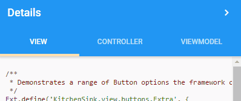

# What's New For Everyone

## Charts

There are two new components and several smaller features in the realm of charts.

### Captions

In previous versions you had to create custom text sprites and position them to 
create titles and such inside the chart. This is now a much simpler process with 
the new captions config. This config is a weighted container of sprite configs 
with three special sprites: title, subtitle and credits.

The three predefined caption types pull their styles from the chart theme, so using 
them requires minimal configuration to get attractive results.

    captions: {
        title: 'The Title'
    }

All captions are positioned by the chart layout and require minimal configuration 
but are commonly adjusted for things like weight and docking.

### Navigator

The navigatorcontainer is a container for a chart that shows a "minimap" of the 
chart’s entire data set and allows the user to interactively adjust the rendered range.

The navigator is fully compatible and automatically syncs bidirectionally with the 
‘panzoom’ interaction.

### Box Plot Series

A common chart type used to show the distribution of data in multiple datasets, the 
boxplot can be used with the scatter series that render outliers (pink dots on the 
screenshot below).

### Curve Smoothing

The new curve config allows you to much more easily customize the appearance of 
line series. It is typically specified as an object like this:

    curve: {
        type: 'cardinal',
        tension: 0.5
    }

The tension config allows you to bring the smoothed curve extremums closer to the 
control points. The optimal value for tension will often depend on the data.

## D3

The big news in D3 is the upgrade to version 4. This upgrade contains breaking 
changes from version 3, so if your application is using D3 directly then you may 
need to make some changes in those areas affected by the 
[changes in version 4](https://github.com/d3/d3/blob/master/CHANGES.md).

We've added new support for zooming and labels to the `d3-sunburst` component. It will 
also animate the labels during zoom.

The new transitions config powers many improvements in tree and other hierarchy 
components (such as d3-heatmap). This config also allows you to customize stock 
transitions and even manage your own.

## PivotGrid

The powerhouse for crunching data, Pivot Grid now gives you even more analytical tools by 
allowing you to render widgets in cells. For example, you can use a sparkline to 
represent a whole series of numbers at a glance.

The new tabular layout (as found in Microsoft Excel) is a great way to see more while 
taking up less space.

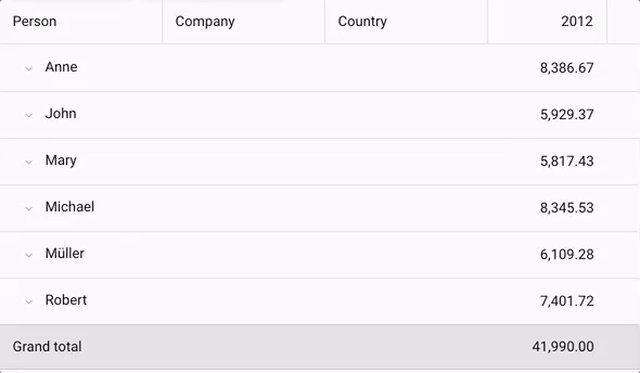

## Exporter

The Exporter package enables you to export data to various file formats. With Ext JS 6.5, 
exporter now supports exporting pivot table definitions, which means your users can now 
export the raw data and the Pivot Table natively into Microsoft Excel.

As you can see above, the exported xlsx file contains the pivot table on the first sheet 
and the raw data on the second sheet.

## Miscellaneous

### Data

The Ext JS data package has supported nested loading for some time. With Ext JS 6.5, you 
now have much greater control of nested data when saving to the server. Previously, you 
could configure the writer to send all associated data like so:

    Ext.define('Order', {
        extend: 'Ext.data.Model',
        proxy: {
            writer: {
                allDataOptions: {
                    associated: true
                },
                partialDataOptions: {
                    associated: true
                }
            }
        }
    });

The problem this presented was that it would gather all available associated data. Including 
data you may not want to write. With Ext JS 6.5, you can now supply a "shape" object for 
the associated data:

    Ext.define('Order', {
        extend: 'Ext.data.Model',
        proxy: {
            writer: {
                allDataOptions: {
                    associated: {
                        orderItems: true
                    }
                },

When the associated config is an object, its keys are the associations you want to 
include. This can be nested multiple levels deep as needed:

    Ext.define('Order', {
        extend: 'Ext.data.Model',
        proxy: {
            writer: {
                allDataOptions: {
                    associated: {
                        orderItems: {
                            item: true
                        }
                    }
                },

### ViewControllers

In some cases a ViewController may need to be bound to the ViewModel and react to 
changes in its data. In previous releases this would be handled in the `initViewModel()` 
method where the necessary calls to bind() could be made. This can now be cleanly 
automated with the new bindings config:

    Ext.define('App.view.MainController', {
        extend: 'Ext.app.ViewController',

        bindings: {
            onChangeFoo: {
                foo: '{foo}',
                bar: '{bar}'
            }
        },

        onChangeFoo: function (data) {
            // data.foo and data.bar will be populated from VM
        }
    });

Since a binding will only deliver once all of its pieces are available, it is not a good 
idea to have just one large bind that accepts everything. When binding to multiple 
values at once, it is recommended to only bind to meaningfully related items.

### Router Hashbang

It can be tedious at times to always be sure to include the '!' part of the '#!' in your 
routes, but the new router config on Ext.app.Application makes it a one-time decision:

    Ext.define('App.Application', {
        extend: 'Ext.app.Application',

        router: {
            hashbang: true

### Google Map Markers

The map component (`Ext.ux.google.Map`) now supports a markers config that makes it easy 
to manage a store of markers (Ext.ux.google.map.Marker records). Manipulating the store 
or its records will have the appropriate effect on the map.

# Conclusion

Well, that just about covers all the big and new things you'll find in Ext JS 6.5! There 
are plenty more details in the API docs. We hope you are as excited as we are with all 
the new capabilities Ext JS 6.5 will bring to your applications!

