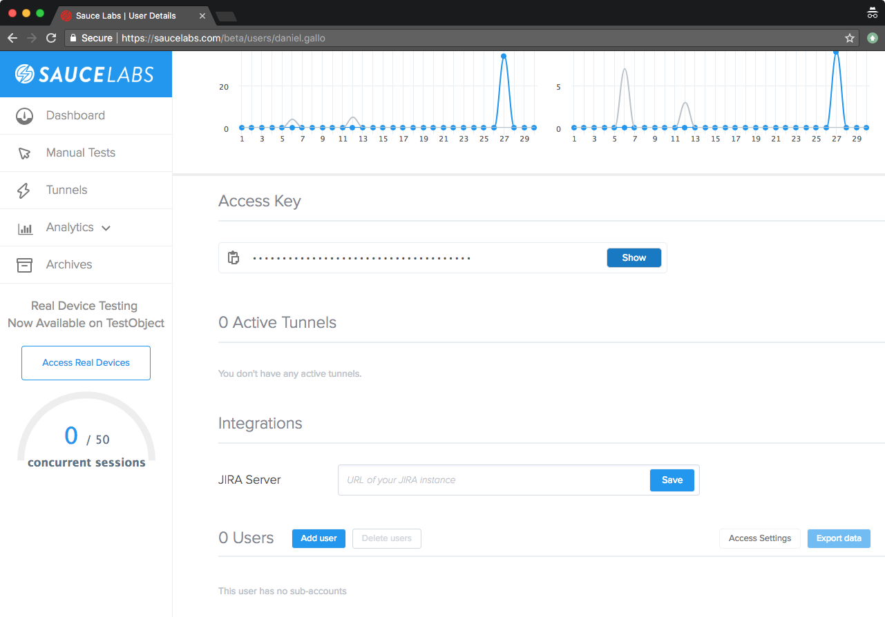
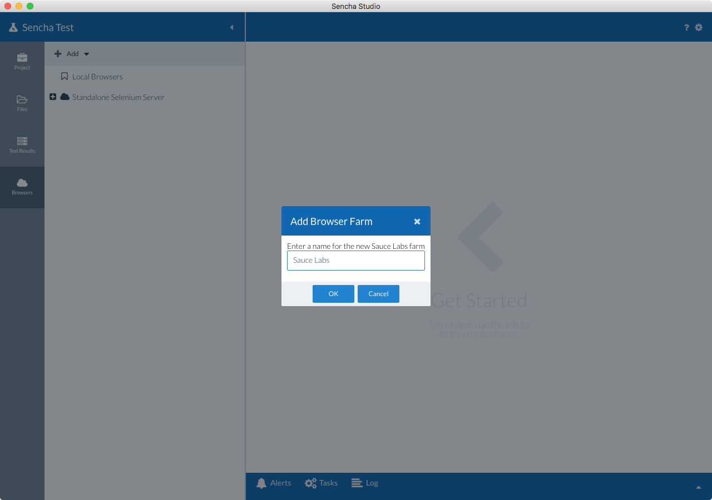

# Sauce Labs

[Sauce Labs](https://www.saucelabs.com) is a cloud based platform for automated 
testing of web applications. 

Rather than spending time and effort manually configuring and maintaining an internal 
browser farm, hosted browser farms such as Sauce Labs already have the 
infrastructure configured on their end, and you are able to quickly and easily leverage 
their various browser instances to test your web applications.

## Using Sauce Labs with Sencha Test

1. Navigate to the [Sauce Labs website](https://www.saucelabs.com), and register for a 
 trial if you don't already have an account.
 
1. After logging in to your Sauce Labs account, navigate to the **My Account** screen
 and scroll down to view your **Access Key**. Copy this key to the clipboard. You will
 need to use this key within Sencha Studio.

    **Note:** If you don't populate the Access Key within Sencha Studio, you will be required
    to define the key when using Sencha Test CLI (stc).
 
    

1. In Sencha Studio, select the **Browsers** tab, and **Add** a configuration for 
 **Sauce Labs**:
 
    

1. After adding the new Browser Farm, change the settings by specifying your Sauce Labs
 **Username**, **Access Key**, setting **Concurrency** to a desired number (e.g. **3**) and clicking **Save**.

    **Note:** By setting **Concurrency** on the farm to **3**, this tells Sencha Test
    that 3 different browsers can be used simultaneously. If this was left at 1, only a single browser
    would be tested, and when that finishes only then would the next browser be started.

    

1. Once the settings have been populated, you can start to specify which browsers you 
 want to use. This is done by creating a Browser Pool. **Right-click** on the 
 **Sauce Labs** node in the tree and select the option to **Add pool**. Enter a meaningful name, such as
 `Sauce Labs Modern Browsers`.
 
    
 
1. You will then be prompted to choose a location to save the configuration file
 for this Browser Pool. We recommend saving this in the Sencha Test workspace folder.
 
1. Select the newly added Browser Pool, and using the drop-down list at the bottom of the 
 screen, select the browsers you want to add, e.g. **Chrome**. The Version drop-down list will default to 
 select the latest version. Click the **Add** button to add this browser and version combination to the list.
 You can then optionally select which Platform you want this browser to run on, along with
 a desired screen resolution.

    

1. After making your changes, click the Save button.

1. Return to the Project tab, and select one of your Scenarios. The newly added list of Sauce Labs browsers 
will be displayed. Select the entire pool, or one or more browsers, to run your tests.

    

## Secure Tunnel - Sauce Connect Proxy

Due to Sauce Labs running as an external service, by default it can only access web apps that are publicly 
accessible (on the Internet). 
In order for Sauce Labs to access any internally hosted apps on your network, you will need to use the 
[Sauce Connect Proxy](https://wiki.saucelabs.com/display/DOCS/Sauce+Connect+Proxy). 

The Sauce Connect Proxy opens a secure connection between a Sauce Labs virtual machine, and your local 
machine or network.

This proxy needs to be started before running your tests. After the secure tunnel is established, Sauce Labs 
will be able to resolve the IP address or host name of the app as defined in the Scenario settings.