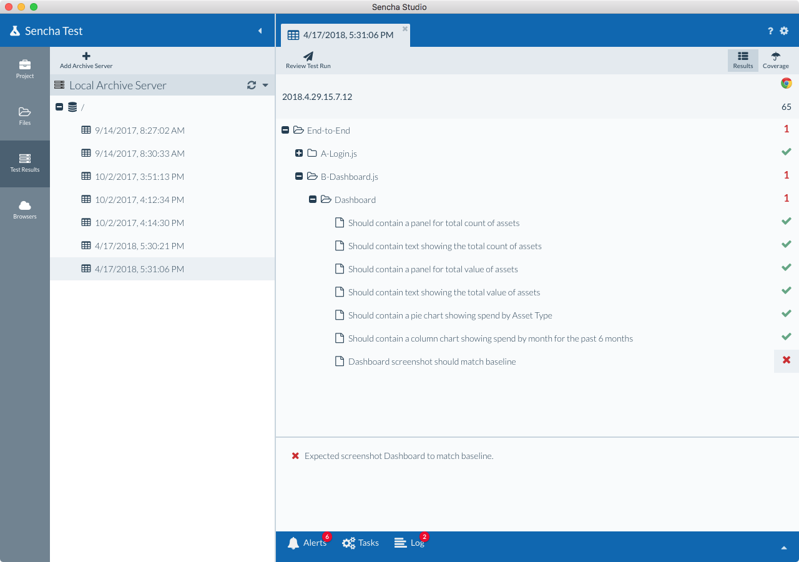

# Screenshot Comparison

One of the powerful features of Sencha Test is its ability to perform screenshot comparisons during test runs.

In order for screenshot comparison to work, the test run has to publish its results to the Archive Server, where 
all the screenshots will be stored.

To perform image comparisons from screenshots, Sencha Test will use an existing run as the reference (baseline) 
against which each image will be compared.

If a baseline for comparison is not present, all comparisons will pass, and the resulting archive directory will 
be used as the baseline for future comparisons.

## Capturing Screenshots

Screenshots are captured through the use of the `ST.screenshot()` API in a test.

For example, the following test would capture what's currently shown in the browser when the test is executed. A 
name for the screenshot has to be defined:

    it('Screenshot should match baseline', function() {
        ST.screenshot('Dashboard');
    });

## Viewing Screenshot Comparison Failures

After a test run has been completed and the results stored in an archive server, you can view any screenshot
failures by going to the Test Results tab, and selecting a test run.

Select the screenshot test that failed (click on the red "X"). A panel will display at the bottom of the test
results window, explaining the failure:

Clicking the failure in the bottom panel will show a preview of the screenshot. The areas of the screenshot 
colored in purple are the differences detected between the baseline and latest test run screenshot:

Double-clicking the message or screenshot in the bottom panel will display a full-screen view where you can 
view in detail the differences between the baseline screenshot, and the latest test run screenshot. On this 
screen, you can switch between different views using the menu in the top-left corner:

* **Difference** - shows the differences highlighted in purple (you can change the color to yellow by clicking 
the Yellow button).
* **Swipe** - shows a swipe view, where you can move a divider left to right and see aspects of the baseline and 
actual image.
* **Swap** - shows a view where you can switch between the baseline and actual image using the "Expected / Actual"
button.

