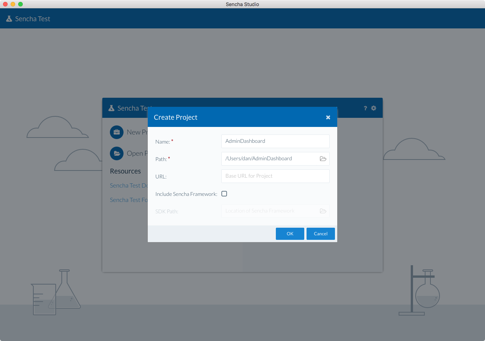
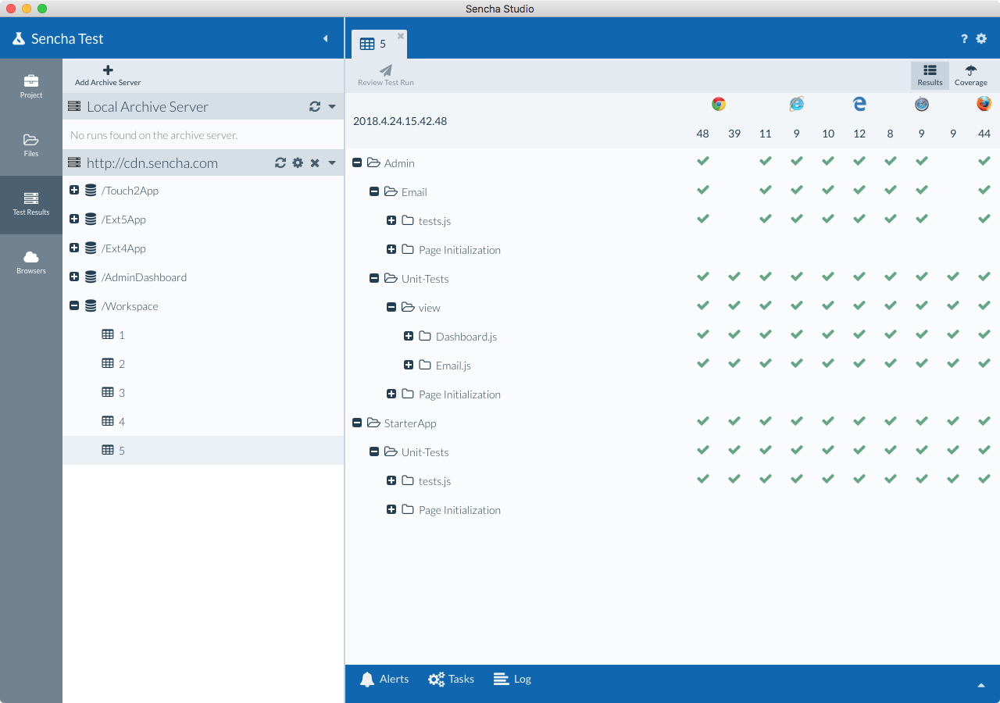
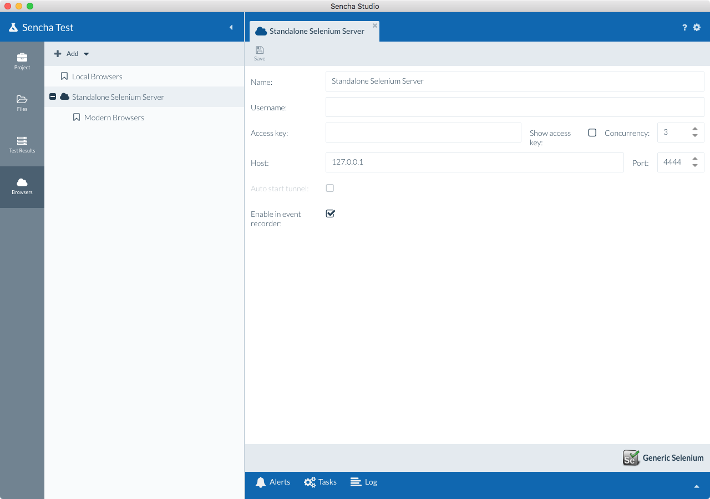

# Getting Started

Once you have [installed Sencha Test](./sencha_test_installation.html), the next step is organizing your
test environment. As a developer or test engineer, Sencha Studio is where most of the action takes place. Once
you have created and configured your test environment in Sencha Studio, you can use the **stc**
command-line tool to automate test execution. This guide will introduce the core concepts for organizing
your test projects and show you how to quickly get going with Sencha Studio.

## Sencha Studio

When launched, Sencha Studio will present you with the welcome screen.  This is where you 
select your role. The role can be changed at a later point in time under Preferences, if needed.

### Roles

Sencha Test utilizes the concept of "roles" to better identify your particular needs.  

### Developer Role
As a developer, you will be able to open an Ext JS project from within Sencha Test and perform
the following operations:

+ Create a development Build using Sencha Cmd
+ Create and run unit tests
+ Create and run end-to-end tests
    + Run tests in-browser
    + Run tests using WebDriver

### Test Automation Engineer Role
As a test automation engineer, you will be able to create a new project and manage all test cases.  You will also be able to perform the following operations:

+ Create end-to-end test cases
    + Run tests using WebDriver

### Switching Between Roles
Once you have selected a persona, the scenarios you create from the project settings screen will belong to that persona.

#### Test Engineer
When you switch from Developer to Test Engineer, you will have options to create end-to-end test cases using WebDriver.

#### Developer
When you switch from Test Engineer to Developer, you will have options to create and run both unit and
end-to-end tests as mentioned above.

## Guided Tour

Next, you will be shown a screen explaining Test's built-in guided tour.  When you first
open many of the views, they will display a guided tour of their various features.

After continuing, you'll be shown a screen explaining our community forum, which is available
[here](https://www.sencha.com/forum/forumdisplay.php?145-Q-amp-A).

We've finally arrived at the root view from which you may open or create a **project**.

## Projects

A project is a top-level container for all the things that define the test environment. A project is simply a
directory in the file system that contains a `"workspace.json"` file. This file is understood by both Sencha Test
as well as Sencha Cmd (6+). This file describes things like applications, packages, themes, Sencha frameworks, and
now **Test Projects**.

You will first need to open an existing project or create a new project. If you are using Sencha Cmd, you can
simply open your existing Sencha Cmd workspace or stand-alone application directly in Sencha Test. Sencha Cmd is
not required, so don't worry if you are not currently using it. If Sencha Cmd is installed, however, Sencha Studio
will enable its Cmd Integration feature by default. This can be disabled using the Preferences dialog. Be aware that
disabling this integration does not change the fact that both Sencha Test and Sencha Cmd will share the same
`"workspace.json"` file.

At present, each application, package, and workspace may contain a single test project (backed by a `test/project.json` 
file by default).  Test projects house the test suites discussed in further detail in later guides.

### Creating Projects
You can create a new project using the “New Project” button on the welcome screen.

1. Click the “New Project” button
1. Choose the destination folder for the project
1. Define a default/base URL, if desired
1. Click "OK"

Once you have created (or opened) a project, Sencha Studio will display it on the welcome screen when you next
launch the application. By default, Sencha Studio re-opens the previously opened project on launch (this behavior can be changed in Preferences).

### Opening a Project
If you have an existing project, for example if you pull the code from a source control repository, you would
click on the “Open Project“ button and select the existing project/workspace folder.  

Sencha Studio seamlessly integrates with projects/workspaces generated by Sencha Cmd, which may house applications, themes, or packages. Simply click “Open Project” to open these projects/workspaces.

### Project Screen
Once you open a project, Sencha Studio will display its contents in the project navigation tree on the left side
of the application. 

In a Sencha Cmd workspace there can be applications in addition to
test projects. Each application has its own test project indicated by the expandable **Tests** node.

The workspace itself can also contain a test project. If the test project is not yet initialized,
this will be indicated by an un-expandable **Tests** node.

To create or configure test projects, see the [Projects, Scenarios and Suites](./testing_applications/test_projects_scenarios_suites.html)
guide.

### Viewing Files
The project tree displays the project contents in a logical structure. You can also view the actual files
and folders in the project by switching to the **Files** tab.

Selecting a text file in the tree will open the file in the Sencha Studio text editor. Selecting unrecognized file types has no effect.

### Reviewing Test Runs
To review results from test runs associated with the project, select the **Runs** tab.

The test runs listed in this tab are retrieved from the associated Sencha Test Archive Server. Selecting a
run will download the results and display them in the content area.

### Configuring Browser Farms
To manage browser farms (for example, WebDriver hubs), select the **Browsers** tab.

From this tab, you can add new browser farm definitions. These defintions can be used in Sencha Studio's Test
Runner or from the command-line using **stc**.

### Switching Workspaces
To return to the welcome screen after opening a workspace, select the following from the application menu:

    File / Sencha Studio        (Windows and Linux / Mac)
        Close Project

You may also select from recently opened projects using the application menu:

    File / Sencha Studio
        Reopen Project
            [recently opened Projects]

You can open a project from any view using the application menu:

    File / Sencha Studio
        Open Project

You may also create a new project using the application menu:

    File / Sencha Studio
        New
            Project...

### Preferences and Help
Sencha Studio has many configuration preferences. These can be accessed using the "gear" icon in the upper-right
of the application.

To get help, click the "?" icon and the Sencha Test Documentation page will be opened in the default browser.

### Additional Items
In addition to the main functional pieces of Sencha Studio, there are three tabs that provide access to some of
the more internal aspects of Sencha Studio:

+ Alerts
+ Tasks
+ Log

The **Alerts** tab contains important messages and items that may require your attention. Alerts are different
from log messages in that they are typically requests for action or important notifications. These messages can
be discarded when you no longer need them.

The **Tasks** tab shows a list of active background activities managed by Sencha Studio.

The **Log** tab will display and filter log messages from various sources (like background tasks). The log can
be easily copied to the clipboard which can help when troubleshooting problems.

## Conclusion
With your initial project set up, you can now proceed to creating your first test suites. Check out the
[Projects, Scenarios, and Suites](./testing_applications/test_projects_scenarios_suites.html) guide for 
instructions on setting
up the organizational structure for your tests. See the 
[stc usage guide](./cli_archive_server/sencha_test_cli.html)
for using **stc** to run your tests from the command-line.

If you have  further questions, concerns, or bug reports, please visit the
[Sencha Test forums](https://www.sencha.com/forum/forumdisplay.php?144-Sencha-Test).
