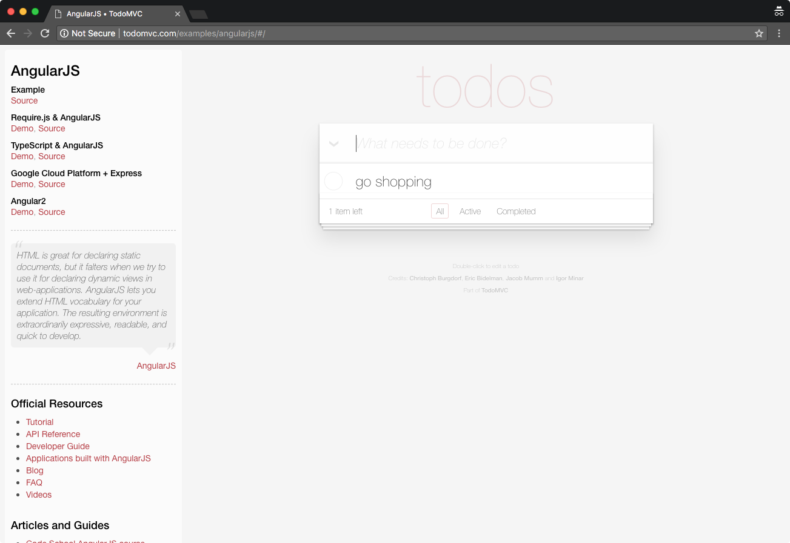
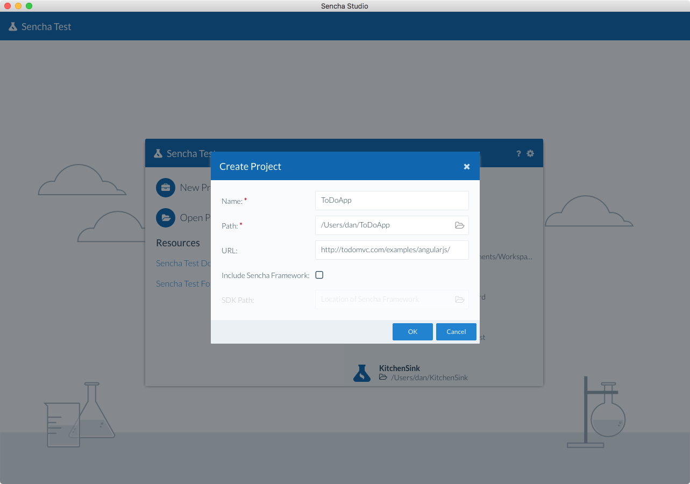
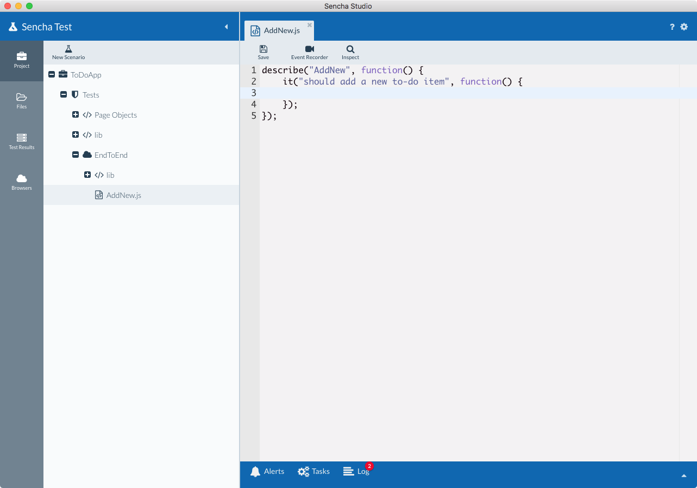
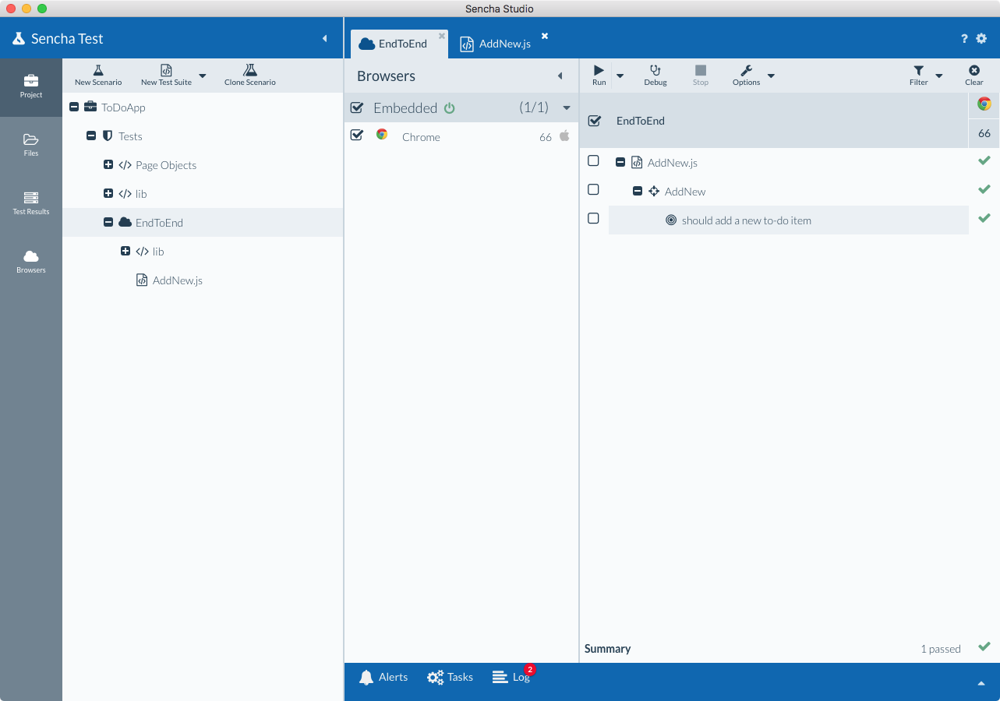

# Testing Other Web Applications

Sencha Test is able to help you write and execute end-to-end tests against non-Sencha web applications
using WebDriver scenarios.

By using capabilities like the Event Recorder and Inspect tool, you are able to quickly generate unique
and stable locators for elements in the page.

This guide walks you through the typical process of using Sencha Test and configuring it to run tests 
against a non-Sencha web application.

## Creating a new Project

1. Open Sencha Studio, and create a new Project. This example uses an AngularJS "to-do" app, available at 
`http://todomvc.com/examples/angularjs/`. 

    

1. Use this URL in the "Create Project" window, along with
defining a project name and folder path. 

    * **Name:** Name of the project, for example `ToDoApp`
    * **Path:** Where the project will be created. Scenarios and test suite files will be added in this location.
    * **URL:** Web address for the running web app, for example `http://todomvc.com/examples/angularjs/`.

    

1. Once the project has been created, you will be able to click on the "New Scenario" button to create
a scenario that will hold your test suite files.

    * **Name:** A name for the scenario, for example if you are creating end-to-end tests, you could call
    the scenario `EndToEnd`
    * **Test type:** Selecting WebDriver will run your tests separately from the browser. This is suitable for
    end-to-end testing. If you have the Test Engineer persona selected in Sencha Studio, this option will be 
    hidden, and new scenarios will default to WebDriver type.
    
    

1. After the scenario has been created, select the scenario in the tree, then click the "New Test Suite" button >> select 
"Jasmine Test Suite" from the menu. Enter a name for the test suite, for example `AddNew`. This creates a new 
Jasmine test suite file. The `.js` file extension gets added automatically.

    

1. With the new test suite loaded in the editor, remove the default expectation, and rename the test/spec
to something more meaningful:

    

1. Start writing some tests by leveraging the 
[Event Recorder](../event_recorder/introduction_to_event_recorder.html) or by writing code using the 
[Futures APIs](../futures_apis/introduction_to_futures_apis.html). You can also leverage the 
[Inspect tool](../inspect_tool/introduction_to_inspect_tool.html) to help you create locators for elements.  In 
the screenshot below, the Event Recorder was utilized to create a new to-do item in the app, then the 
Futures APIs have been used to assert that the new item was added successfully. The Inspect tool helped
to generate the locator of the added item:

    

    Here is the completed code for the test suite:

        describe("AddNew", function() {
            it("should add a new to-do item", function() {
                // Add a new item to the list using Event Recorder generated script
                ST.play([
                    { type: "tap", target: "@new-todo", x: 138, y: 38 },
                    { type: "type", target: "@new-todo", text: "go shopping" },
                    { type: "type", target: "@new-todo", key: "Enter" }
                ]);
            
                // Use Futures APIs to check item added to list
                ST.element('@todo-list/li/div/label')
                    .textLike('go shopping');
            });
        });

1. Run the test by selecting the scenario in the tree, choosing a browser (Chrome, for example), and clicking
the Run button.  You should see a new browser window launch with the app loaded, and the steps carried out.
The test should pass after a short wait:

    

## Further Information

For more information on scenarios and test suites, see the 
[Projects, Scenarios and Suites guide](./test_projects_scenarios_suites.html#testing_applications-_-test_projects_scenarios_suites_-_test_projects_and_scenarios).