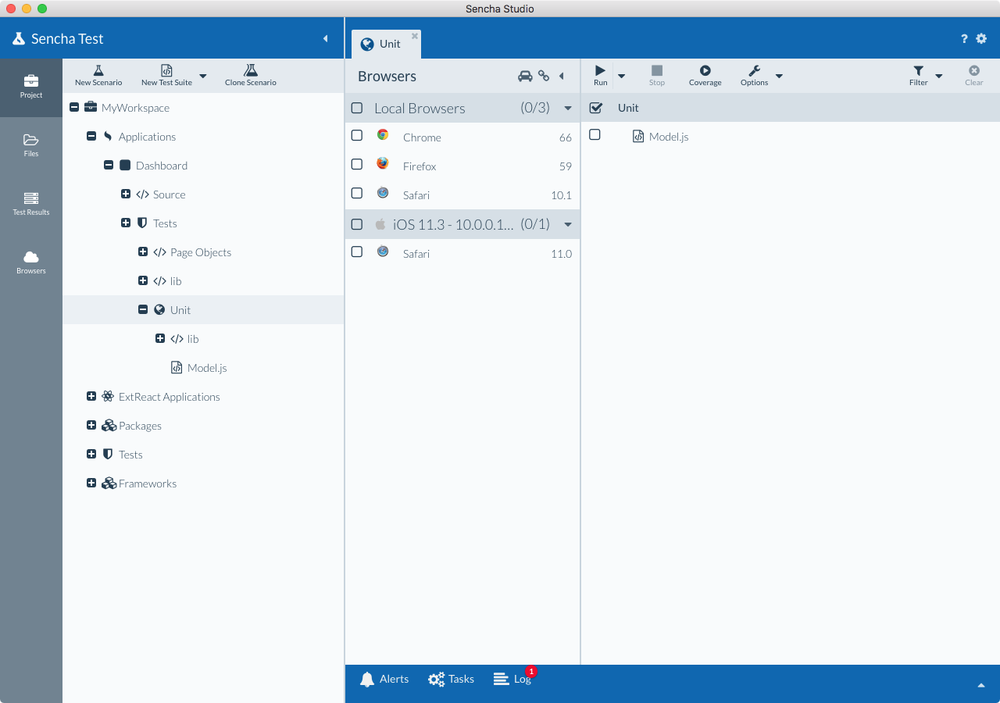
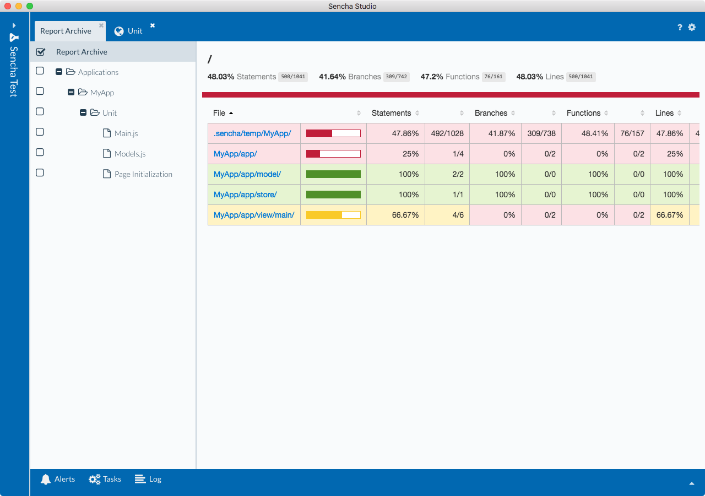

# Test Runner

Once you’ve [authored a few tests](./test_projects_scenarios_suites.html) for your application, 
you’ll likely want to run those tests within the browsers you aim to support. 

The test runner in Sencha Test allows you to specify the tests you want to run and in which 
environment. These tests can then run within your machine's browsers in addition to 
virtual machine browsers, mobile device browsers, and browser farms.

## Navigating to a Test Runner

To start, you’ll want to open your workspace and expand the test project containing the tests you 
want to run. By 
default, this would be the "Tests" node from the workspace navigation tree. Applications 
and packages within a workspace will also have test projects within them that can be 
initialized.  

After expanding the target Test Project, select the Scenario from within 
the test project housing the test specs. By selecting the Scenario from the navigation 
tree, you’ll see the Scenario’s test runner tab appear on the right.

## Anatomy of a Test Runner

### Available Browsers
For In-Browser scenarios, Sencha Test examines its surrounding environment and displays browsers from your local machine under the heading 
“Local Browsers” in the “Browsers” view of the test runner tab. This includes multiple versions of the same browser. For 
instance, you may have a beta version and several past versions of Chrome. These will all be detected and will show up 
as "Local Browsers". 

The version detected by Sencha Test will show up in the right-hand column next to the name of the browser. To the left 
you'll see a checkbox (as well as a checkbox in the Local Browser header). 

In addition to local browsers, you are also able to run the same tests on browsers on other devices on the network or 
browsers from a remote browser farm (more below).

For WebDriver scenarios, Sencha Test will by default show Google Chrome under an "Embedded" section. This uses
an embedded Selenium Server instance within Sencha Test to launch your WebDriver tests against Chrome. To run 
tests against additional browsers, you will need to 
[configure a browser farm](../browser_farms/introduction_to_browser_farms.html).

### Scenario Tests
The Scenario view displays the test suites, specs, and expectations in a tree layout with checkboxes next to each 
node. The checkboxes allow you to indicate the tests you want to run against your target browsers. Additionally, the 
heading has a checkbox that will allow you run all tests inventoried in your particular scenario. Selecting browsers 
from the "Browsers" view will add columns next to the available tests. These browser columns will display the outcome 
of a completed test.

## Running Tests
### Selecting Target Browsers
To begin testing, checkmark one or more browsers as targets for your tests. When working within a Sencha Cmd application, 
an instance of “app watch” will spin up when you initially select a browser. "app watch" is a background web server 
instance that assists in coordinating test runs between the parent application and the target browsers. 

When "app watch" starts, you’ll see an orange “eye” icon next to the application name in the Workspace tree. Once 
"app watch" initializes and is ready to serve the application, you’ll see the “eye” icon turn gray. You are then able to 
run your selected tests.

### Running Tests
Once your target browsers are selected, check the box by the tests you wish to run from the tests tree-view and click 
the "Run Selection" button. 

You’ll notice that selecting browsers causes their icons to show up in columns next to the 
test's list. As the tests proceed, you’ll see that passing tests add a check-mark in the browser column next to that 
test. Likewise, failed tests will set a red “x”. Parent test suite nodes will have either a green check-mark if all child 
tests passed or a number indicating the count of fails for that suite. You can terminate an in-progress test run by 
clicking on the "Stop Run" button in the top toolbar.

**Note:** In addition to selecting each test individually, you can check the header checkbox to run all tests. Doing so 
will not toggle tests you may have selected with the tests tree.

When a test fails it will supply details about the failure for each browser experiencing the issue. Click on the red 
“x” under each affected browser to expand the test summary view below the tests tree. These details will give you an 
idea of what may need to be addressed in order to find the root cause of the issue. 

Additionally, the tests are run within the browser itself, which gives you access to the browser’s developer tools for 
real-world troubleshooting. Tests can be re-run by clicking on the "Run Selection" button once more. The testing results 
can be cleared altogether using the "Clear Results" button.

**Note:** Tests running on browsers in the background can potentially run more slowly than a browser in the foreground 
due to OS processing prioritization.

## Non-Local Browsers
For In-Browser scenarios, one of the more helpful features built into Sencha Test is the ability to easily test browsers on devices connected to the 
same network as the machine running Sencha Test. 

If you click the "Clear Results" button after running tests with your 
local browsers, you’ll notice that the URL in the browser is an address like 10.0.0.118:8800. In this example, 
"10.0.0.118" is the local IP address used by the internal web server by way of Sencha Test. This page is a “parked page” 
that is effectively linked to Sencha Test and in a state of waiting for additional tests.

**Note:** If multiple local adapters are discovered by Sencha Test, you may see “localhost:8xxx” instead of a literal 
IP address. In this case you can specify the ideal IP to use within: 

    Sencha Test > Preferences > Network tab > External Address.

In order to run the same tests on another device on the same network, enter the “parked address” in the browser of another 
device. We’ll use 10.0.0.118:8800 for the purpose of this guide. 

The separate device could be another computer, laptop, tablet or phone. Once you’ve entered 10.0.0.118:8800 in the 
remote device's browser, you’ll notice that the Browsers view in the test runner tab has 
a new entry.  Local browsers will show up with a heading of "Local Browsers". Externally 
synced browsers will show up with a heading showing the platform they’re operating 
within. For example, linking the Safari mobile browser on an iPad shows up as “Safari 11” 
under a heading of “iOS 11.3”. 

Once the remote browser and Sencha Studio are connected you will follow the same steps as 
when testing local browsers only:

1. Check the remote browser along with your local browsers 
1. Select the tests to run
1. Click the "Run Selection" button 

The tests will then begin and report back to Sencha Test without any further work from the remote device!

**Note:** In the top toolbar of the test runner tab you’ll see a “link” icon. Clicking this button will copy the test 
target page’s URL to the clipboard. This can be a helpful shortcut when pointing browsers within a Virtual Machine to 
the Sencha Test runner.

## Browser Farms / Pools
Browsers hosted virtually by a browser farm, such as Sauce Labs, will also show up as target browsers in the test 
runner's Browsers view. 

For more information see the [browser farm guide](../browser_farms/introduction_to_browser_farms.html).

## Running Tests with Code Coverage
The "Coverage" button in the top toolbar enables you to run your tests with code coverage enabled. This 
option is only available for In-Browser scenarios.

Sencha Test contains an integrated version of Istanbul, a leading JavaScript code coverage
tool, with which you can identify the gap in the amount of code that you have covered and
not covered with your tests. Leveraging this integration, Sencha Test provides a detailed
breakdown to the level of Statements, Branches, Functions, and Lines in a readable format
with percentage analysis.

Using the code coverage report is a great way to reduce project risk due to critical code
not being properly tested.

After running tests with code coverage enabled, a code coverage report will be displayed after the 
test run is complete.

To exclude files/folders from the scope of the code coverage report, use the Project Settings screen in 
Sencha Studio. For example, the Ext JS SDK directory should be excluded, as you would want to focus the code 
coverage analysis on just your own application code. To exclude all code files within the `ext` directory, 
use this code coverage filter:

    ^/ext/.*?$

