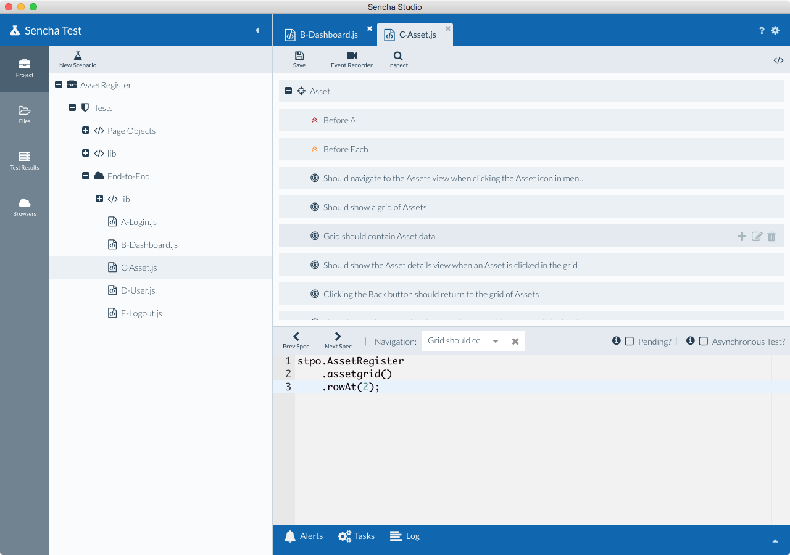
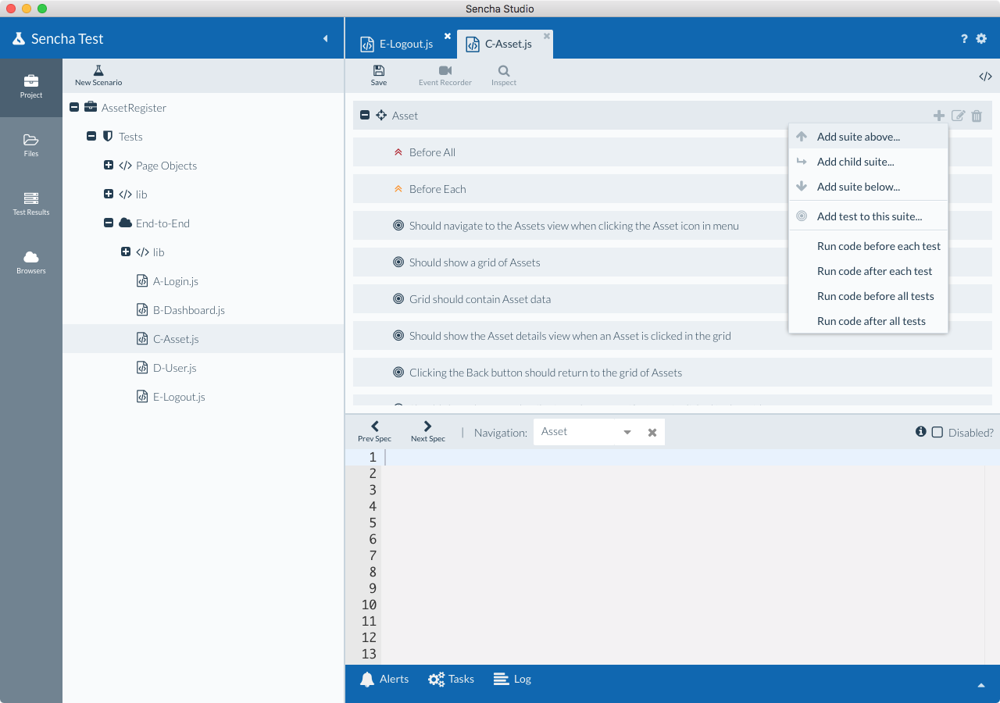

# Visualize Test Code

Writing tests for JavaScript and Jasmine can be a daunting task, especially if you are 
new to either technology (or both!). If you are transitioning from manual testing to 
automated testing, the functional method of programming can put you off course. 

The new "Tree View" in the Sencha Studio test editor provides an easy way to visualize one 
test at a time while keeping the functional aspects of Jasmine test creation hidden. By 
leveraging the tree view with the Inspect tool and Page Objects, you can focus on 
the test at hand and create tests much faster.

## Functionality/Overview

* Switch between Tree View and Code View

* Create New Higher Level Test Suite, Individual Tests, PreConditions, PostConditions 
using a graphical interface

* Indicate if a test has an Asynchronous nature using a checkbox that invokes Jasmine’s 
"done" functionality

* Focus on one test at a time

* Leverage the dropdown or search to quickly move between tests

* Create new tests, launch the Inspect feature, identify locators, build page objects 
and insert them directly in the test code

* If you are comfortable programming in JavaScript then you can use the code view to 
write tests.

## Accessing the Code Tree View

1. Create a new Jasmine test file and open it in the editor, or open an existing test file. Your
test file will contain a Jasmine test suite ("describe" function).

2. Click on the button on the upper right hand corner that switches the editor to the 
tree view (Hint: You can default to opening files in tree view by unchecking "Default to source 
view for tests" in Preferences > Editor)

## Using the Code Tree View

The Code Tree view helps you add new suites, tests and code blocks via a menu, as shown below.

Let’s look at what these different options do:

1. **Add suite above:** Adds a new Test Suite (**describe()** function) above the current 
one. It is better to have one higher level suite per test file but in rare conditions 
this can be a possibility. Hence use this option if you need to add a new **describe** 
function above the current one.

2. **Add child suite:** Jasmine allows **describe** blocks to be nested. While this can be 
advantageous in some circumstances, highly nested suites can increase the effort required 
to maintain your collection of tests, so you should exercise caution when structuring your 
tests.

3. **Add suite below:** This is similar to the first point except the new **describe** will be 
added below the current test suite.

4. **Add test to this suite:** This is the main option. In order to add tests to the 
current suite, use this option. This will create a new (**it()** function) that is 
considered as a test in the Jasmine framework.

5. **Run code before each test:** Jasmine allows preconditions (**beforeEach()** function) 
to be run before each test (**it** function) is executed. **Example:** If you want 
to ensure that you are on the home page before every test in a suite is executed, you can add 
a click on home page test step into this function.

6. **Run code after each test:** Jasmine allows postconditions (**afterEach()** function) 
to be run after each test (**it** function) is executed. **Example:** If you want to run 
login tests with multiple use cases then you may have to click on a reset button after 
every test. You can include the click reset button condition in this function and Sencha 
Test will execute it after every login use case is tested.

7. **Run code before all tests:** Unlike **beforeEach**, this precondition (**beforeAll()** 
function) will run once before the first test is executed. **Example:** This can be a 
test to verify page is loaded before kicking off test execution.

8. **Run code after all tests:** Unlike **afterEach**, this postcondition 
(**afterAll()** function) will run once after the last test is executed. **Example:** This 
can be a test to run a routine to reset all data after test execution is completed.

## Test Case ("it" function)

Jasmine considers every "it function" as a test. In the Tree View, the individual tests 
can be selected and the test code can be written for that individual use case. In this 
screen you can do the following:

1. Launch Inspect feature, create locators and insert Sencha Test API code. Once the API 
code is inserted, add actions and assertion to finish your test case.

2. Launch Inspect feature, create locators and save page objects. Once the page object 
code is inserted, add actions and assertion to finish your test case.

3. Write Sencha Test API code directly if you know the component and locator.

Options on the screen:

1. **Prev Spec:** Click on this to navigate to the previous test case.

2. **Next Spec:** Click on this to navigate to the next test case.

3. **Navigation:** Select the dropdown to see a list of tests and jump to the one that 
you want. Once a test is selected, clear the selection and type in part of a test name - all 
tests that match the typed text will be listed.

4. **Pending:** Select this option to mark the test as "pending", meaning it will be skipped
during a test run. This is useful if you want to skip a test, either because it isn't complete, 
or you need to check the behavior of the applicaiton when a step is not executed. Behind the scenes,
your "it" function is changed to "xit" in the code, which tells Jasmine this is a pending test.

5. **Asynchronous Test:** Web applications are able to kick off a process and move on to a 
different process without waiting for the first process to finish. This is possible 
due to the asynchronous nature of JavaScript. Enabling the "Asynchronous test" checkbox 
will tell Sencha Test to wait until the process is complete before moving on to the next 
test. This option will invoke the "**done**" function in the Jasmine framework that was 
specifically designed to deal with the asynchronous nature of JavaScript. You will need to 
call `done()` within your test suite in order for it to pass.
