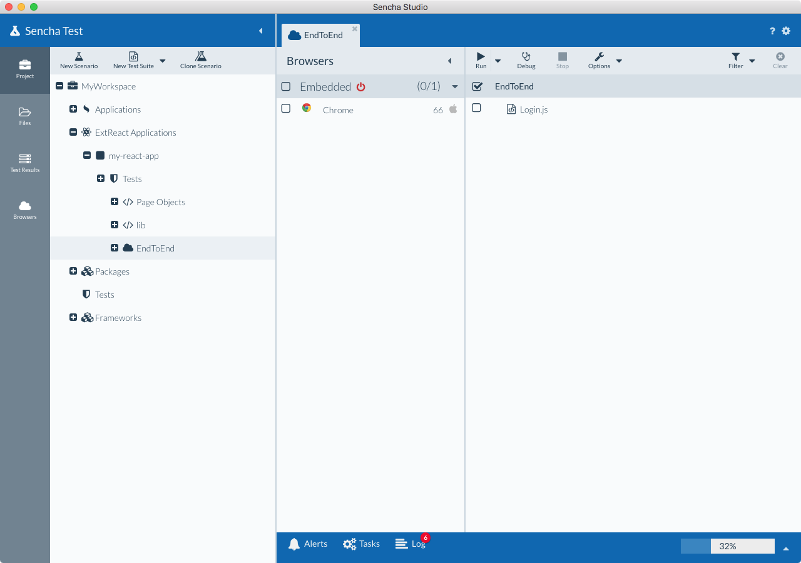
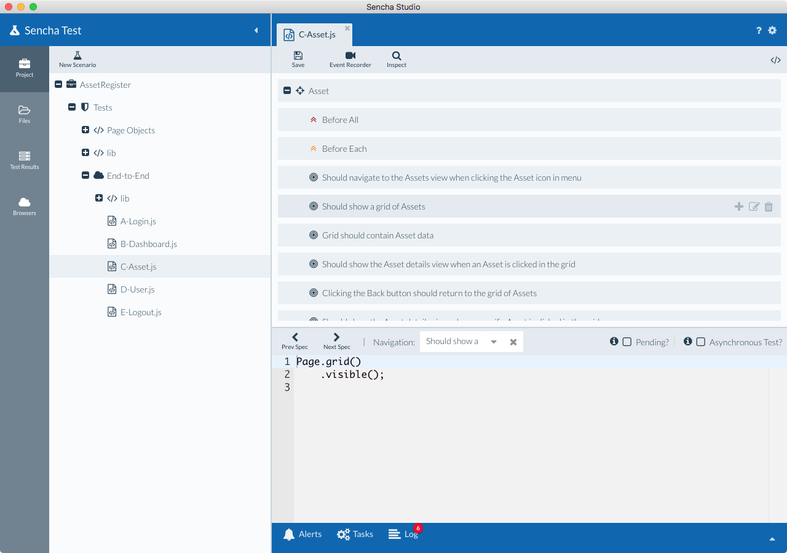

# What’s New in Sencha Test 2.2.0

Sencha Test 2.2 has new features which make it easier to create tests, manage defects and 
store results.  New features in this release include:

+ Support for ExtReact: write application (end-to-end) tests for ExtReact apps

+ Support for writing application (end-to-end) tests for non-Sencha web applications

+ Create and utilize Page Objects within the Inspect tool to build robust tests for web applications

+ Select and use unique locators using a DOM Tree directly from Sencha Studio using the Inspect tool

+ Visualize tests using a tree view and focus on the test under construction

+ New Futures APIs for interacting with HTML Tables

+ New Futures API for interacting with the Ext JS Slider component

Some of these new features are covered in more detail below.

## ExtReact App Support

In this release, you can write application (end-to-end) tests for ExtReact apps. You can either create your tests in a new Sencha Test project, or open the ExtReact app in Sencha Studio and add the tests to the project folder structure itself. 

### Opening ExtReact Apps in Sencha Studio

In order to open your ExtReact app in Sencha Studio and add your tests to the app folder, the ExtReact app needs to reside within a Sencha Cmd workspace, so that it can be opened in Sencha Studio. This can either be a blank workspace just for the ExtReact app, or one with other Ext JS apps/packages. 

Modify the `workspace.json` file to define the presence of any ExtReact apps, by adding a new `extreact` config, and defining the folder names of the ExtReact applications that reside within the workspace folder:

    {
        /**
        * Array of Ext JS apps
        */
        "apps": [
            "Dashboard"
        ],

        /**
        * Array of ExtReact apps
        */
        "extreact": {
            "apps": [
                "my-react-app"
            ]
        }

        ...

When you open the workspace in Sencha Studio, you will see your ExtReact apps show up in the project structure under the "ExtReact Applications" node, and you will be able to add your scenarios and tests. These will be created within a `test` folder inside of the ExtReact app folder.

### Locators for ExtReact Components

When locating ExtReact components, you can use the capitalized class names of the components in the locators.  For example, a panel component in Ext JS would typically use the `xtype` of `panel` in its locator:

    ST.component('panel[title="My Panel"]');

But in a ExtReact app, the capitalized class name of `Panel` can also be utilized, as demonstrated in this example:

    ST.component('Panel[title="My Panel"]');

This new locator strategy works in apps using ExtReact 6.5.1+.

## Testing Other (non-Sencha) Web Applications

The Inspect tool in this release supports the inspection of elements in standard HTML pages; not just Ext JS / ExtReact apps. This enables Sencha Test to be used for testing web applications that aren't using Sencha frameworks.

In combination with the `ST.element` Future API, and newly added `ST.table` API, it's possible to more easily author tests that target various HTML elements in the page, including other third-party grid components that render on screen as an HTML table.

For example, using the `ST.table` API, a test can be written that finds a particular row by string value within a HTML table, and asserts that one of the cells matches a certain value:

    it('should find the grid row by string value', function() {
        ST.table('@mytable')
            .rowWith('Sencha')
            .cellAt(3)
            .textLike(/United States/i);
    });

Or, in this example, reference a table row by index and click on the row:

    it('should click the third row in the grid', function() {
        ST.table('@mytable')
            .rowAt(2)
            .click();
    });

## Create and utilize Page Objects

Page Objects allow you to create a central lookup list of all the components/elements on a 
page in the application under test. 

You can reuse them in multiple tests by instantiating the page object when needed. This means you can avoid having to copy and paste a locator across multiple test cases, which minimizes the need to modify the locator value when the developer changes the label from "Subject" to something else (for example), or one of the other underlying attributes is changed.

After creating a Page Object, you can leverage it throughout your test suites using the `stpo` namespace.  For example, with a Page Object named `AdminDashboard`, and a locator named `emailView`, you can reference that component/element using this code:

    stpo.AdminDashboard
        .emailView()
        .visible();

For more information, see the guide on [Creating and Using Page Objects](../inspect_tool/creating_using_page_objects.html).

## DOM Tree in the Inspect Tool

When inspecting a page, the Inspect tool now shows a Element hierarchy for easier inspection of the DOM Tree. If your web app is not utilizing Sencha frameworks, this means you are now able to leverage the Inspect tool to help you create meaningful and stable locators for elements, and add them to a Page Object, if desired. 

## Visualize Tests Using a Tree View

We’ve designed a new way to visualize your test code and focus on one test case at a time. This feature helps teams organize tests more effectively and easily take advantage of many other capabilities, including reordering tests via drag and drop, searching and jumping to a specific test in a file, and more importantly, creating an empty test case, launching the Inspect tool, identifying components from the application, and building a test case.

The new Tree View for test suites is the default view if you have the Test Engineer persona selected, but this default view can be changed to the Code view if needed, by going to Preferences -> Editor -> checking the "Default to source view for tests" checkbox.

Alternatively, you can switch between the Source view and the Tree view at anytime by using the toggle button in the top-right corner of the editor window.

